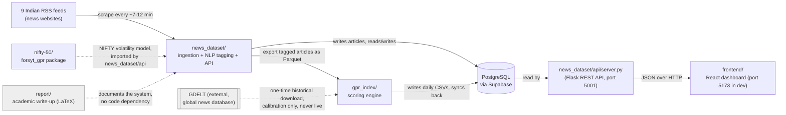

# Forsyt — Site Map (Start Here)

This is the map to read before opening any code. It assumes you know nothing about this project, its subject matter, or its tech stack — for any term that isn't explained inline, check **[`docs/GLOSSARY.md`](GLOSSARY.md)**.

If you only read one section, read [§1](#1-what-forsyt-actually-does) and [§4](#4-i-want-to--where-do-i-look).

---

## 1. What Forsyt actually does

Forsyt reads Indian news every day, figures out which articles are about wars, sanctions, border tension, terrorism, or diplomatic crises, and turns that into two things:

1. **A daily "India GPR" number** (geopolitical risk score) — roughly, "how much scary-geopolitics news happened today," scaled so a normal/quiet day sits around 100.
2. **12 trade-corridor risk scores** — the same idea, but broken out per shipping/border route that matters to India (e.g. Strait of Hormuz, the India-China border).

Those numbers, plus a searchable feed of the tagged articles, get shown on a web dashboard alongside real NIFTY 50 stock market data — deliberately presented as two *separate* signals side by side, because the project's own research found that the geopolitical score does **not** actually improve market-volatility forecasts. Honesty about that negative result is a deliberate design choice here, not an oversight.

This is a 5-person college capstone project (Thapar Institute, CSE), not a commercial product — see `report/` for the academic write-up and `docs/PROJECT_GUIDE.md` for what's actually built vs. originally proposed.

## 2. The big picture — 5 modules and how data flows between them

In one sentence: **RSS → `news_dataset` (Postgres) → NLP tagging → Parquet → `gpr_index` (scoring) → Postgres → `news_dataset/api` (Flask) → `frontend` (React)**, with `nifty-50`'s volatility model plugged in as a side input to the API layer, and everything except your own local dev server kept fresh by scheduled GitHub Actions jobs — nobody's laptop needs to be running for the data to update.

## 3. Folder-by-folder

Top level of the repo:

| Folder | What it is | Language/stack | Deeper docs |
|---|---|---|---|
| `frontend/` | The dashboard website end-users see | React + TypeScript + Vite + Tailwind | [`frontend/docs/ARCHITECTURE.md`](../frontend/docs/ARCHITECTURE.md) |
| `news_dataset/` | Scrapes news, tags it with NLP, serves the API | Python (Flask) | [`news_dataset/docs/codebase.md`](../news_dataset/docs/codebase.md), [`theory.md`](../news_dataset/docs/theory.md) |
| `gpr_index/` | Turns tagged articles into the daily GPR + corridor scores | Python | [`gpr_index/docs/gpr-theory.md`](../gpr_index/docs/gpr-theory.md), [`corridor-theory.md`](../gpr_index/docs/corridor-theory.md) |
| `nifty-50/` | Forecasts NIFTY 50 volatility, tests whether GPR helps | Python | [`nifty-50/docs/INTEGRATION.md`](../nifty-50/docs/INTEGRATION.md) |
| `report/` | The team's academic capstone report (LaTeX) — documentation only, not imported by any code | LaTeX | n/a (not a code module) |
| `docs/` | Project-wide documentation (this file and its siblings) | Markdown | — |
| `.github/workflows/` | The 5 scheduled jobs that keep data fresh in production | YAML (GitHub Actions) | [`docs/CLOUD_PIPELINE.md`](CLOUD_PIPELINE.md) |

### `frontend/src/` — one level deeper

| Path | Purpose |
|---|---|
| `main.tsx` | Entry point — mounts the React app into the page. |
| `App.tsx` | Defines every route/page (`/`, `/news`, `/macroeconomics`, `/trade-corridor`, `/portfolio-exposure`, `/quality`). |
| `pages/` | One file per dashboard screen (`Home.tsx`, `NewsDashboard.tsx`, `MacroDashboard.tsx`, `CorridorRiskDashboard.tsx`, `PortfolioDashboard.tsx`, `AccuracyDashboard.tsx`). |
| `components/` | Reusable UI pieces used across pages (charts, cards, the map, the globe, the header/footer). |
| `hooks/` | Reusable data-fetching logic (`useHomeLiveData.ts`). |
| `lib/` | Non-UI logic: the API client (`api.ts`), copy/label generators, map geometry helpers, canvas chart drawing. |
| `assets/` | Images — note: currently none of these are actually used (see `docs/DISCREPANCIES.md`). |

### `news_dataset/` — one level deeper

| Path | Purpose |
|---|---|
| `ingestion/` | Scrapes the 9 RSS feeds, dedupes, writes to Postgres. |
| `nlp/` | Tags each article with themes, tone, and locations. |
| `export/` | Converts tagged articles into the Parquet format `gpr_index` reads, and syncs `gpr_index`'s CSV output back into Postgres. |
| `pipeline/` | The orchestration scripts that glue ingestion → NLP → export → scoring together (what the scheduled GitHub Actions jobs actually run). |
| `api/` | The Flask server and everything it needs to answer requests. |
| `db.py` | All PostgreSQL access — schema definitions and every read/write helper. |

### `gpr_index/` — one level deeper

| Path | Purpose |
|---|---|
| `main.py` | Command-line entry point (`python gpr_index/main.py <subcommand>`). |
| `scripts/gkg_gpr_pipeline.py` | The core scoring/normalization engine — the heart of the whole project. |
| `scripts/corridors.py`, `corridor_index.py` | The 12-corridor registry and per-corridor scoring. |
| `scripts/split_era.py` | Keeps the old GDELT-calibration baseline and the live India baseline from contaminating each other. |
| `data/` | Downloaded/processed article data (gitignored — not in git). |
| `outputs/` | Generated CSVs, plots, and validation reports (intentionally committed to git, unlike `data/`). |
| `tests/` | Automated tests for the scoring/normalization/corridor logic. |

### `nifty-50/` — one level deeper

| Path | Purpose |
|---|---|
| `forsyt_gpr/` | The actual product/library code: `data.py` (loads GPR + price data), `features.py` (builds model inputs), `vol_model.py` (the volatility forecasting model + backtests), `dual_signal.py` (combines everything into the payload the dashboard shows). |
| `data/` | Reference CSVs (Caldara/Iacoviello benchmark data, NIFTY price history). |
| `output/` | Generated figures/tables — some of these are now orphaned snapshots from deleted research scripts (see `docs/DISCREPANCIES.md`). |

## 4. "I want to... → where do I look?"

| I want to... | Look at |
|---|---|
| Change what a dashboard page looks like | `frontend/src/pages/*.tsx` (pick the page) and its supporting `frontend/src/components/*.tsx` |
| Add or remove a news source | `news_dataset/ingestion/geo_pipeline.py` (`TIER1_FEEDS`/`TIER2_FEEDS`) |
| Change how an article gets its risk score | `gpr_index/scripts/gkg_gpr_pipeline.py` (`score_articles`, `normalize_index`) |
| Add/remove a trade corridor, or change one's exposure weighting | `gpr_index/scripts/corridors.py` |
| Change what counts as a geopolitical "theme" | `gpr_index/scripts/taxonomy.py`, `news_dataset/nlp/themes.py` |
| Change how articles are deduplicated | `news_dataset/ingestion/geo_pipeline.py` (`find_duplicate`) |
| Add/change an API response field | `news_dataset/api/page_bundles.py` (bundles), `api/gpr_service.py` / `api/market_service.py` (data) |
| Change the NIFTY volatility model | `nifty-50/forsyt_gpr/vol_model.py`, `features.py` |
| Change the map or globe visualization | `frontend/src/components/CorridorRiskMap.tsx`, `HeroGlobe.tsx` |
| Understand the GPR math in full | `gpr_index/docs/gpr-theory.md` |
| Understand the corridor math in full | `gpr_index/docs/corridor-theory.md` |
| See what's scheduled to run automatically and when | `docs/CLOUD_PIPELINE.md`, `.github/workflows/*.yml` |
| See what's actually built vs. originally proposed | `docs/PROJECT_GUIDE.md` |
| See every doc/code discrepancy found in this project | `docs/DISCREPANCIES.md` |
| Look up a term I don't recognize | `docs/GLOSSARY.md` |

## 5. Suggested reading order for a total beginner

1. This file (you're reading it).
2. [`docs/GLOSSARY.md`](GLOSSARY.md) — skim it once so terms don't stop you later.
3. [`docs/PRODUCT.md`](PRODUCT.md) — what the shipped product actually is, page by page.
4. [`docs/PROJECT_GUIDE.md`](PROJECT_GUIDE.md) — the honest "what's done vs. what's not" status.
5. Pick one module folder above and read its own docs (`gpr_index/docs/gpr-theory.md` is the densest and most rewarding if you want to understand the actual "risk score" idea).
6. [`docs/DISCREPANCIES.md`](DISCREPANCIES.md) — so you know which parts of the docs/README to *not* fully trust yet.
7. `README.md` last — as of this pass it's been rewritten to describe only what's actually built, so it's safe to take at face value.
