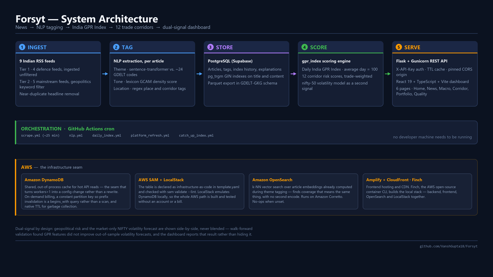

# Forsyt — 3-Minute Video

A story-led script. It still hits the four required points — **about the project · tech stack & architecture · how you used AWS · learning and growth** — but carries them inside a story, so the viewer feels the problem before they see a single screen.

**Positioning line (say it once, exactly like this):**
> Forsyt turns the news into a number you can track — India's geopolitical risk, priced daily.

**Runtime: 463 spoken words ≈ 2:54 at 160 wpm.** That is a normal brisk presentation pace. If you speak slower than 160, you *will* run over — use the cut list at the bottom, it's sized for exactly that.

---

## The spine of the story

Three beats, in this order. Everything else hangs off them.

1. **A real loss.** Something moves in the world → it reaches an ordinary Indian investor weeks later as *"markets fell on global cues."* That sentence is where the information died.
2. **A number instead of a sentence.** Forsyt makes the invisible thing measurable — daily, India-first, down to the specific shipping lane.
3. **It shows its work.** Every score cites the headlines behind it, so the viewer is never asked to trust a black box.

The video is built to make the viewer feel beat 1 before you show them anything. A judge who feels the problem will want the product. A judge shown the product first will merely grade it.

---

## Shot list

| # | Time | Words | On screen | Beat |
|---|------|-------|-----------|------|
| 1 | 0:00–0:21 | 55 | **Cold open.** No dashboard. A news clip or headline of a shipping/border event, then a plain black card: *"markets fell on global cues"* | The loss |
| 2 | 0:21–0:34 | 37 | Full-screen: **170,000,000+ demat accounts** — then hold on one ordinary trading screen or news feed | Who this is for |
| 3 | 0:34–1:03 | 119 (shots 3+4) | **Home page** — the GPR number, the regime badge, the history chart | The number |
| 4 | 1:03–1:19 | ↑ | **Trade Corridor page** — the map, click a corridor, the explanation panel citing real headlines | Specificity + trust |
| 5 | 1:19–1:34 | 39 | **The dual-signal panel**, held still. Ideally on a day the two dials diverge | The thesis |
| 6 | 1:34–1:55 | 56 | **`docs/forsyt-architecture.png`**, highlighting stages 1→5 | Tech stack & architecture |
| 7 | 1:55–2:30 | 94 | `template.yaml` → `cache.py` → terminal running `sam validate --lint` → the orange AWS band on the diagram | How I used AWS |
| 8 | 2:30–2:45 | 41 | Back to the Home page, slow push in on the index number | Why I built it |
| 9 | 2:45–2:54 | 22 | End card: live URL, repo URL | Close |

**Direction notes**

- **Do not open on the dashboard.** Every other submission opens on a dashboard. Open on the problem — you have roughly eight seconds before a judge decides what kind of video this is.
- Shot 1 has **no UI at all**. It's the only thing that earns you the right to show a product.
- Shot 5 is worth hunting for: find a day in the history chart where geo risk is elevated and market volatility is calm, and freeze there. That single frame *is* the idea.
- Hard cuts, no transitions. Burn the URL in small at the bottom-right from shot 3 onward — if a judge wants to open it mid-video, let them.
- Slow down on the numbers, speed up slightly on the architecture. Energy rises into shot 5, then drops and goes quiet for shot 8. Shot 8 is the only part you deliver softly.

---

## The script

### Cold open · 0:00–0:21 · 55 words

> A tanker takes fire in the Red Sea.
>
> Within hours, shipping lines reroute around Africa. Freight rates jump. The cost of everything India moves through that lane starts to change.
>
> Three weeks later, it reaches an ordinary Indian investor as a single sentence: **"markets fell on global cues."**
>
> That sentence is where the information died.

### Who this is for · 0:21–0:34 · 37 words

> There are more than **170 million demat accounts** in India. Behind a lot of them is someone checking their portfolio between other things — watching a number move against them, and getting one sentence that explains nothing.

*Add back only if you finish under 2:45:* “The information exists — it's just scattered, written for specialists, and priced in by the time it's readable.” (+7s)

### What Forsyt is · 0:34–1:19 · 119 words

> **Forsyt turns the news into a number you can track.**
>
> Every twenty-five minutes it reads nine Indian news sources, tags each article for geopolitical theme, tone and location, and rolls them into one daily figure — the **India GPR Index** — calibrated so an ordinary day reads 100.
>
> *(cut to Corridor page)* And underneath it, the part that changes a decision: **twelve trade corridors** — Hormuz, Malacca, the Red Sea, the India–China border — each scored on its own.
>
> Because "global risk is up" isn't a decision. **"The lane carrying your crude is up"** is.
>
> Click any one, and it explains itself — citing the headlines that moved the score. You're never asked to just trust it; you can read what's behind it.

### The thesis · 1:19–1:34 · 39 words

> This is the panel I'd put on a billboard.
>
> Geopolitical risk on one side, market volatility on the other — two independent signals, side by side, **never blended**. When they pull apart, that gap is the thing worth seeing.

### Tech stack and architecture · 1:34–1:55 · 56 words

> It's a one-way pipeline. RSS into **PostgreSQL**. An NLP layer tags every article for theme, tone and location. A scoring engine writes the daily index and corridor scores. A **Flask** API, and a **React and TypeScript** dashboard on top.
>
> **GitHub Actions** keeps it fresh on a schedule — nothing of mine has to be switched on.

### How I used AWS · 1:55–2:30 · 94 words

> AWS sits at the seam where this stops being a prototype.
>
> The API's cache lived inside one process, pinning the service to a single worker. I moved it onto **DynamoDB**, declared as infrastructure-as-code in **AWS SAM** — on-demand billing, a partition key shaped so invalidation is a query rather than a table scan, and a fail-open policy: a cache error costs a recomputation, never a request.
>
> *(run `sam validate --lint`)*
>
> I build that path locally against **LocalStack** — no AWS account needed. **OpenSearch** does vector search over embeddings the pipeline already had. **Amplify and CloudFront** serve the frontend.

### Why I built it · 2:30–2:45 · 41 words

> I kept reading that same sentence, and realised nobody was going to fix it.
>
> What I learned is that the hard part was never the modelling. It was making risk **legible** to someone who isn't an analyst and has ninety seconds.

### Close · 2:45–2:54 · 22 words

> Forsyt is live, and it runs without me.
>
> So the next time markets fall on global cues — you'll know which cue.

---

## Delivery notes

- **"markets fell on global cues"** appears at the open and again at the close. That repetition is structural — it closes the loop, and it's the one thing a judge will still remember an hour later. Say it identically both times; don't paraphrase.
- Pause a full beat after *"That sentence is where the information died."* It needs the silence.
- Shot 2 is where the viewer either joins you or doesn't. Don't read it as a market-size statistic — read it as a description of a person. The number is there to make one person feel like many.
- The AWS section is the only part written to be spoken quickly and precisely — it's evidence, not persuasion. Judges scoring that rubric point listen for named services, each with a reason attached. Every service in that paragraph has a *because*. Keep the becauses.
- Don't say "we built", "we implemented", "our project", or "hackathon". Describe what it *does*, present tense, as a thing that exists.

### Optional: make the cold open yours

The tanker open works because it's concrete. It's stronger still if you have a true version — a moment you or someone close to you got blindsided by a move nobody explained. If you do, put it in shot 1 in your own words and keep the *"global cues"* card as the punchline. Only if it's genuinely true: a judge can hear a manufactured anecdote, and the tanker version stands on its own.

---

## Verify before you claim it

Three lines assert things about the world or the deployment. Check each or soften it — a judge who catches one wrong number discounts everything after it.

1. **"more than 170 million demat accounts"** — from the project README, as of 2024. Confirm the current figure, or say "over 170 million as of 2024".
2. **"Amplify and CloudFront serve the frontend"** — `docs/STACK_GAP_AND_IMPLEMENTATION_PLAN.md` records the frontend there, but also notes Elastic Beanstalk was decommissioned, leaving the backend without a live host. If it isn't live, say "built to deploy on Amplify and CloudFront" and demo locally.
3. **"Forsyt is live, and it runs without me"** — the *pipelines* genuinely run unattended on GitHub Actions. If the site itself isn't hosted right now, change it to "The pipeline runs without me" — still true, still impressive.

Two things to keep out of the script:

- **Don't claim users, traction or revenue.** There aren't any yet, and one follow-up question exposes it. The story rests on the problem being real, not on the product being adopted — it doesn't need traction to work.
- **Don't imply the index predicts the market.** The dual-signal line is written as two independent signals shown side by side, never blended — which is both accurate and the more interesting claim. An unprovable prediction claim is the one thing that could cost you the room in Q&A.

---

## Cut list

Only if you're running long. In this order:

1. "This is the panel I'd put on a billboard." (−9 words, −3s) — the panel still lands without the intro
2. "calibrated so an ordinary day reads 100" (−8 words, −3s)
3. "A scoring engine writes the daily index and corridor scores." (−10 words, −4s)
4. "What I learned is that the hard part was never the modelling." (−13 words, −5s) — keep the *legible* sentence after it

That's 21 seconds of slack, enough to absorb a 140-wpm delivery.

**Never cut:** the cold open, the *"global cues"* card, the corridor line ("the lane carrying your crude"), the citations line, the DynamoDB/SAM sentences, or `sam validate`. Three are load-bearing for the story, two for the AWS rubric point, one for trust.
