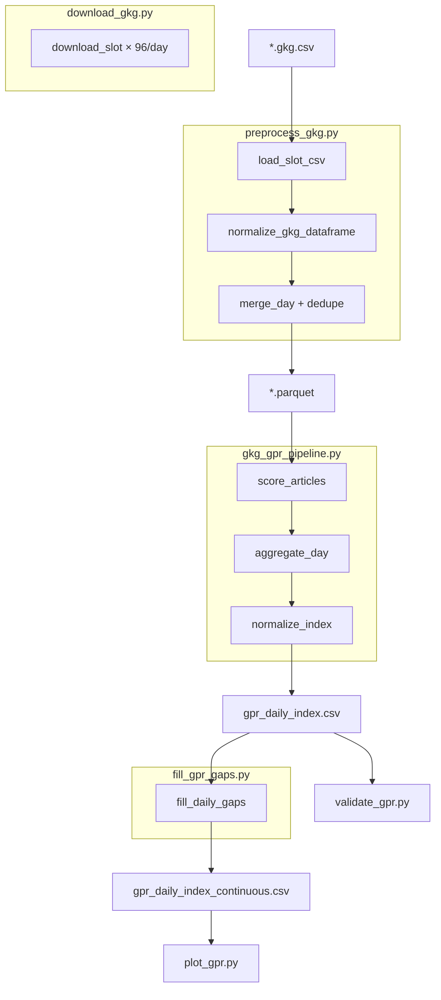

# Forsyt — Complete Code Walkthrough

**Purpose of this document:** Explain **every function** and **every meaningful line of code** in the active Forsyt pipeline, as if you are presenting the codebase to someone who has never seen it.

For GPR **math and theory**, see [gpr-theory.md](./gpr-theory.md).

**How to read this doc:**

- Line numbers refer to the file **at the time this doc was written** — if code moves, search by function name.
- **Private functions** start with `_` (internal helpers).
- **Public entry points** are `main()` and `run()` in each script.
- The active pipeline lives entirely in `gpr_index/main.py` + `gpr_index/scripts/*.py`.

---

## Table of contents

1. [`main.py`](#1-mainpy) — CLI router (52 lines)
2. [`scripts/download_gkg.py`](#2-scriptsdownload_gkgpy) — GDELT download (170 lines)
3. [`scripts/preprocess_gkg.py`](#3-scriptspreprocess_gkgpy) — Slot merge → Parquet (214 lines)
4. [`scripts/gkg_gpr_pipeline.py`](#4-scriptsgkg_gpr_pipelinepy) — Core GPR engine (692 lines)
5. [`scripts/fill_gpr_gaps.py`](#5-scriptsfill_gpr_gapspy) — Calendar imputation (261 lines)
6. [`scripts/diagnose_gpr_scoring.py`](#6-scriptsdiagnose_gpr_scoringpy) — Scoring QA (256 lines)
7. [`scripts/validate_gpr.py`](#7-scriptsvalidate_gprpy) — Benchmark validation (753 lines)
8. [`scripts/plot_gpr.py`](#8-scriptsplot_gprpy) — Charts (189 lines)
9. [`scripts/reprocess_gpr_index.py`](#9-scriptsreprocess_gpr_indexpy) — Re-normalize wrapper (42 lines)

---

## 1. `main.py`

**Role:** Single CLI entry point. Does **not** contain GPR logic — only dispatches to the correct script module.

### Lines 1–19 — Module docstring

Documents the eight pipeline commands and a copy-paste quickstart for 2025. Printed when user runs `python main.py` with no args or an unknown command.

### Lines 21–23 — Imports

| Line | Code | Why |
|------|------|-----|
| 21 | `from __future__ import annotations` | Allows forward-referenced type hints on older Python |
| 23 | `import sys` | Only stdlib needed — reads `sys.argv` for command name |

### Lines 25–34 — `COMMANDS` dict

Maps **CLI verb → Python module path**:

```python
"download"   → scripts.download_gkg
"preprocess" → scripts.preprocess_gkg
"gpr"        → scripts.gkg_gpr_pipeline
...
```

Keys are what the user types after `python main.py`. Values are importable module names (dots, not slashes).

### Lines 37–48 — `main()`

| Lines | What happens |
|-------|--------------|
| 38 | If fewer than 2 argv entries **or** argv[1] not in `COMMANDS` → show help |
| 39 | `print(__doc__)` — prints module docstring (quickstart) |
| 40–42 | If user typed unknown command, print error + sorted list of valid commands |
| 43 | Exit 0 if no command (help only), exit 1 if bad command |
| 45 | `import importlib` — deferred import so `--help` on subcommands still works when routed |
| 46 | `importlib.import_module(COMMANDS[sys.argv[1]])` — load e.g. `scripts.gkg_gpr_pipeline` |
| 47 | **Rewrite argv:** `[main.py, gpr, --flags]` becomes `[main.py, --flags]` so subcommand's `argparse` doesn't see the word `gpr` |
| 48 | Call `mod.main()` on the loaded module |

### Lines 51–52 — Script guard

Standard Python idiom: only run `main()` when executed as `python main.py`, not when imported.

---

## 2. `scripts/download_gkg.py`

**Role:** Download GDELT GKG **96 fifteen-minute files per day** from the public GDELT v2 HTTP server.

### Lines 1–14 — Docstring

Documents output naming (`YYYYMMDDHHMMSS.gkg.csv`), idempotent re-runs, and example CLI.

### Lines 16–25 — Imports

| Import | Used for |
|--------|----------|
| `argparse` | CLI flags |
| `datetime` | Date iteration |
| `time.sleep` | Rate limiting between HTTP requests |
| `zipfile` | Extract downloaded `.zip` |
| `pathlib.Path` | Cross-platform paths |
| `requests` | HTTP GET to GDELT |

### Lines 28–33 — Module constants

| Name | Value | Meaning |
|------|-------|---------|
| `BASE_URL` | `http://data.gdeltproject.org/gdeltv2` | GDELT v2 file server root |
| `ALL_TIME_SLOTS` | 96 strings `"0000"`, `"0015"`, … `"2345"` | Every 15-min slot in a day |

Built by nested comprehension: 24 hours × 4 quarters = 96 slots.

---

### Function: `generate_dates(start_date, end_date)` — Lines 36–45

**Returns:** Generator yielding `datetime.date` objects, inclusive.

| Line | Action |
|------|--------|
| 38–39 | Parse `"YYYY-MM-DD"` strings into `date` objects |
| 40–41 | Raise if end before start |
| 42–45 | Loop `cur` from start to end, yield each day, add 1 day |

---

### Function: `_build_url(day, hhmm)` — Lines 48–49

**Private.** Builds download URL:

```
http://data.gdeltproject.org/gdeltv2/20250101120000.gkg.csv.zip
                                 ^^^^^^^^ ^^^^
                                 YYYYMMDD HHMM + "00" seconds
```

---

### Function: `_raw_csv_path(raw_dir, day, hhmm)` — Lines 52–53

**Private.** Local path where extracted CSV should live:

`data/gkg_raw/20250101120000.gkg.csv`

---

### Function: `_download_file(url, zip_path, timeout=120)` — Lines 56–64

**Private.** HTTP download.

| Line | Action |
|------|--------|
| 58 | `requests.get` with 120s timeout |
| 59–60 | Return `False` if HTTP status ≠ 200 (file not on server) |
| 61 | Write response bytes to zip path |
| 62 | Return `True` on success |
| 63–64 | Any network/IO exception → return `False` (caller treats as missing) |

---

### Function: `_extract_zip(zip_path, raw_dir, delete_zip=True)` — Lines 67–79

**Private.** Unzip first file inside archive to `raw_dir`.

| Line | Action |
|------|--------|
| 69–72 | Open zip; if empty namelist → fail |
| 73 | Extract **first** entry only (GDELT zips contain one CSV) |
| 74–75 | Corrupt zip → return `False` |
| 76–78 | `finally`: delete zip if `delete_zip` (default saves disk space) |
| 79 | Return `True` if extraction succeeded |

---

### Function: `download_slot(day, hhmm, raw_dir, delay_seconds, keep_zip=False)` — Lines 82–111

**Public helper.** Download one slot if not already on disk.

**Returns:** `(downloaded: bool, available: bool)`

| Case | downloaded | available | Meaning |
|------|------------|-----------|---------|
| CSV already exists | False | True | Skip — idempotent |
| Downloaded + extracted OK | True | True | New file |
| HTTP 404 / failed | False | False | GDELT doesn't have this slot |

**Line-by-line:**

| Lines | Action |
|-------|--------|
| 96–98 | If CSV exists → return `(False, True)` immediately |
| 100–101 | Build URL and local zip path |
| 103–107 | Download; on failure delete partial zip, sleep, return `(False, False)` |
| 109 | Extract; `delete_zip=not keep_zip` |
| 110 | Sleep again (rate limit) |
| 111 | Return `(True, True)` only if extraction worked |

---

### Function: `run(start_date, end_date, raw_dir, delay_seconds, keep_zip)` — Lines 114–144

**Orchestrator** called by `main()`.

| Lines | Action |
|-------|--------|
| 121 | Create output directory |
| 122–123 | Counters for summary |
| 125 | Loop each calendar day |
| 126–128 | Per-day counters |
| 130–137 | Loop all 96 slots; call `download_slot`; update counters |
| 139 | Count how many CSV files exist for this date (glob `YYYYMMDD*.gkg.csv`) |
| 140 | Print daily status: new downloads, total present / 96, missing count |
| 142–144 | Print run totals |

---

### Function: `parse_args()` — Lines 147–154

Defines CLI:

| Flag | Default | Purpose |
|------|---------|---------|
| `--start-date` | 2025-01-01 | Range start |
| `--end-date` | 2025-12-31 | Range end |
| `--raw-dir` | data/gkg_raw | Output folder |
| `--delay-seconds` | 0.3 | Pause between requests |
| `--keep-zip` | off | Don't delete zip after extract |

---

### Function: `main()` — Lines 157–165

Parse args → call `run()` with `Path` objects.

---

## 3. `scripts/preprocess_gkg.py`

**Role:** Merge 96 raw slot CSVs into **one Snappy Parquet per day**, deduplicated and cleaned.

### Lines 41–45 — Column mapping constants

| Name | Value | Meaning |
|------|-------|---------|
| `GKG_USECOLS` | `[1, 3, 4, 8, 10, 15, 17]` | **0-indexed** column numbers in raw GKG TSV |
| `GKG_NAMES` | 7 names | Rename those columns to readable names |

GDELT GKG files have **no header row** — columns are positional.

---

### Function: `generate_dates` — Lines 48–56

Same date-range generator as download script (duplicated intentionally — each script is self-contained).

---

### Function: `normalize_gkg_dataframe(df)` — Lines 59–90

**Core cleaning function.** Converts raw string columns → typed pipeline schema.

| Lines | Action |
|-------|--------|
| 61–62 | Empty input → return `None` |
| 64 | Copy to avoid mutating caller's DataFrame |
| 65–67 | Parse `SQLDATE` from `%Y%m%d%H%M%S` string to datetime |
| 68 | Drop rows where date parse failed |
| 69–70 | If all rows dropped → `None` |
| 72–73 | Fill empty doc IDs with `""`, drop zero-length IDs |
| 74–75 | If no articles left → `None` |
| 77 | Fill missing source names |
| 78–81 | **Strip theme offsets:** GDELT appends `,N` word-count suffixes to themes — regex `,\d+` removes them |
| 82 | Fill locations |
| 84 | Split `V2Tone_raw` on commas (pandas Series of lists) |
| 85 | Field 0 → `tone_overall` |
| 86 | Field 2 → `tone_neg` (absolute value) |
| 87 | Field 3 → `tone_polarity` (absolute value) |
| 88 | Drop raw tone column |
| 89 | Fill GCAM string |
| 90 | Return cleaned DataFrame |

---

### Function: `load_slot_csv(csv_path)` — Lines 93–117

Read one slot file.

| Lines | Action |
|-------|--------|
| 96–111 | Try UTF-8, then latin-1 encoding (GDELT files mix encodings) |
| 98–108 | `read_csv`: tab-separated, no header, only 7 columns, all strings, skip bad lines |
| 113–115 | If both encodings fail → warn and return `None` |
| 117 | Pass through `normalize_gkg_dataframe` |

---

### Function: `merge_day(day, raw_dir, processed_dir)` — Lines 120–148

Merge all slots for one calendar day.

| Lines | Action |
|-------|--------|
| 122–123 | `ymd = "20250101"`; glob all `20250101*.gkg.csv` |
| 124–125 | No files → `None` |
| 127–131 | Load each slot; collect non-None DataFrames |
| 133–134 | All slots failed → `None` |
| 136 | Concatenate vertically |
| 138–142 | **Dedup:** sort by `SQLDATE`, `drop_duplicates` on `DocumentIdentifier`, `keep="last"` — latest slot has richest tone/GCAM |
| 145–147 | Write `gkg_processed_{ymd}.parquet` with Snappy compression |
| 148 | Return output path |

---

### Function: `run(...)` — Lines 151–190

| Lines | Action |
|-------|--------|
| 157 | Ensure processed dir exists |
| 162–169 | For each day: if Parquet already exists → SKIP (idempotent) |
| 171–172 | Else call `merge_day` |
| 173–175 | Failure → record date in `failed_dates` |
| 177–183 | Success → read row count for log message |
| 185–190 | Print summary: processed / skipped / failed counts |

---

### Functions: `parse_args()`, `main()` — Lines 193–213

Standard argparse + `run()` wrapper with `--raw-dir` and `--processed-dir`.

---

## 4. `scripts/gkg_gpr_pipeline.py`

**Role:** The **heart of Forsyt** — score every article, aggregate daily, normalize to GPR index, write outputs.

This file has ~692 lines. Sections below follow the file's own comment dividers.

---

### Lines 1–24 — Module docstring

Documents Equation 1, score component caps, output filenames, and CLI example.

### Lines 26–36 — Imports

| Import | Purpose |
|--------|---------|
| `argparse` | CLI |
| `json` | Checkpoint state serialization |
| `re` | Parquet filename regex |
| `defaultdict` | Country score accumulation |
| `Path` | File paths |
| `typing` | Type hints |
| `numpy` | Vectorized math |
| `pandas` | DataFrames, Parquet I/O |

---

### Lines 43–82 — Taxonomy and tuning constants

#### `TIER1`, `TIER2`, `TIER3` (lines 43–56)

`frozenset` of GDELT V2Themes codes. **Immutable** — safe to use in hot loops.

- **TIER1** weight 1.0 → geopolitical **acts** (war, invasion, coup…)
- **TIER2** weight 0.6 → **threats** (sanctions, military actors…)
- **TIER3** weight 0.3 → **context** (espionage, cyber…)

#### Score caps (lines 58–66)

| Constant | Value | Role |
|----------|-------|------|
| `THEME_CAP` | 0.50 | Max theme component |
| `TONE_NEG_CAP` | 0.20 | Max from negative tone |
| `TONE_POL_CAP` | 0.10 | Max from polarity |
| `TONE_NEG_MIN` | 5.0 | Tone must exceed this to count |
| `GCAM_CAP` | 0.20 | Max GCAM component |
| `GCAM_DIM_MIN` | 0.15 | GCAM dimension activation floor |
| `GPR_POSITIVE_THRESHOLD` | 0.20 | Article must exceed this to enter daily sum |

#### Index shape (lines 68–71)

| Constant | Value | Role |
|----------|-------|------|
| `INDEX_TAIL_EXPONENT` | 2.45 | Amplifies above-average days |
| `UPPER_TAIL_STRETCH` | 1.08 | Extra stretch for values ≥ median |

#### `EVENT_CATEGORIES` (lines 74–82)

Dict mapping **8 sub-index names** → frozenset of theme codes. Used for `gpr_event_type.csv`.

---

### Function: `_parse_gcam(gcam_str)` — Lines 89–104

**Private.** Parse one GCAM string like `"c18.1:0.2,c18.3:0.5,c9.1:0.1"`.

| Lines | Action |
|-------|--------|
| 91 | Initialize four floats to 0 |
| 92 | Split on comma → key:value pairs |
| 93–94 | Skip malformed pairs (no colon) |
| 95–96 | Split on first `:` only |
| 97–99 | Parse value as float; skip non-numeric |
| 100–103 | Assign to `c18_1`, `c18_2`, `c18_3`, or `c9_1` by exact key match |
| 104 | Return 4-tuple |

Unrecognized keys are silently ignored.

---

### Function: `_parse_gcam_series(gcam_col)` — Lines 107–113

**Private.** Apply `_parse_gcam` to every row in a pandas Series.

| Line | Action |
|------|--------|
| 108 | `fillna("")` then `.apply(_parse_gcam)` — one tuple per row |
| 109–112 | Build DataFrame with 4 columns, preserve index |
| 113 | `.clip(lower=0.0)` — GCAM values cannot be negative |

---

### Function: `_extract_countries(v2loc)` — Lines 120–131

**Private.** Parse GDELT `V2Locations` field.

Format per entry: `Type#FullName#CountryCode#...` separated by `;`

| Lines | Action |
|-------|--------|
| 122–123 | Track seen codes; output list preserves first-seen order |
| 124 | Split on `;` → location entries |
| 125–126 | Split entry on `#`; country code is **index 2** |
| 127 | Uppercase country code (ISO-style 2-letter) |
| 128–130 | Dedupe within article |
| 131 | Return list of country codes |

---

### Function: `score_articles(df)` — Lines 138–198

**Most important function.** Adds 6 columns to a copy of input DataFrame.

**Parameters:** `df` — one day's processed Parquet (must have `V2Themes`, `GCAM`, tone columns)

**Returns:** DataFrame with scoring columns added

#### Setup (lines 140–146)

| Line | Action |
|------|--------|
| 140 | Copy input — never mutate caller's DataFrame |
| 141 | `n = len(out)` — article count |
| 143 | Split `V2Themes` on `;`, uppercase, handle NaN → list-of-lists |
| 145 | Allocate zero arrays for tier hit counts |
| 146 | Initialize all articles as `gpr_type = "none"` |

#### Theme loop (lines 148–153)

**Not vectorized** — Python double loop over articles and theme tokens:

| Line | Action |
|------|--------|
| 148 | `enumerate(themes_list)` — index `i` aligns with row |
| 149 | Inner loop over theme tokens in this article |
| 150 | Strip whitespace |
| 151–153 | If token in TIER1 → += 1.0; elif TIER2 → += 0.6; elif TIER3 → += 0.3 |

Same theme code twice **counts twice** (rare in practice).

#### Theme score (lines 155–160)

| Line | Action |
|------|--------|
| 155 | `raw_theme = t1 + t2 + t3` (element-wise) |
| 156 | `theme_score = min(0.50, raw_theme / 3.0)` — divide by 3 per paper, cap at 0.50 |
| 158–160 | Set `gpr_type`: overwrite context → threat → act (act wins) |

#### Tone score (lines 162–170)

| Line | Action |
|------|--------|
| 162 | Read `tone_neg`, coerce to float, abs, NaN→0 |
| 163 | Same for `tone_polarity` |
| 164–168 | **Negative component:** 0 if below floor; else linear ramp to cap over 25 tone units |
| 169 | **Polarity component:** linear ramp to 0.10 cap over 20 units |
| 170 | Sum = `tone_score` |

#### GCAM score (lines 172–178)

| Line | Action |
|------|--------|
| 172 | Parse all GCAM strings → 4-column DataFrame |
| 173–176 | Zero out dimensions ≤ 0.15 threshold |
| 177 | Weighted sum: 40% c18.3 + 30% c18.2 + 20% c18.1 + 10% c9.1 |
| 178 | **Only if TIER1 hit (`t1 > 0`):** cap at 0.20; else GCAM = 0 |

#### Final score (lines 180–187)

| Line | Action |
|------|--------|
| 180–181 | If `theme_score == 0` → `gpr_score = 0`; else sum components capped at 1.0 |
| 183–187 | Write columns back to `out` |

#### Event category (lines 189–196)

| Line | Action |
|------|--------|
| 190 | Start all as `"other"` |
| 191–194 | Loop categories in dict order; **first match wins**; only if still `"other"` |
| 193 | Set intersection between article themes and category's theme set |
| 195 | Articles with zero score → category `"none"` |
| 196–198 | Assign column; return |

---

### Function: `aggregate_day(scored, date_val)` — Lines 205–230

Collapse one day's scored articles → one dict (one CSV row before normalization).

#### Boolean masks (lines 206–209)

| Variable | True when |
|----------|-----------|
| `total` | Row count = A_t |
| `pos` | `gpr_score > 0.20` |
| `acts` | `gpr_type == "act"` |
| `threats` | `gpr_type == "threat"` |

#### Dict fields (lines 211–227)

| Key | Formula / meaning |
|-----|-------------------|
| `date` | Passed-in timestamp |
| `total_articles` | `total` |
| `candidate_count` | articles with any GPR theme (type ≠ none) |
| `gpr_positive_count` | count of `pos` |
| `positive_share` | positive count / total |
| `mean_score` | mean gpr_score among positives only |
| `gpr_sum` | sum gpr_score among positives |
| `acts_sum` | sum among act AND positive |
| `threats_sum` | sum among threat AND positive |
| `raw_ratio` | **gpr_sum / total** — core index input |
| `acts_ratio` | acts_sum / total |
| `threats_ratio` | threats_sum / total |
| `mean_theme_score` etc. | component diagnostics among positives |

#### Event sums (lines 228–229)

Loop all 8 categories + `"other"`: `sum_{cat}` = total gpr_score for articles in that category (includes non-positive — note this differs from gpr_sum filter).

---

### Function: `aggregate_country_day(scored, date_val, total)` — Lines 233–245

| Lines | Action |
|-------|--------|
| 234 | Filter to GPR-positive articles only |
| 235–236 | Empty → return `[]` |
| 237 | `defaultdict(float)` for country → accumulated score |
| 238–240 | For each positive article: extract countries from V2Locations; add full article score to each country mentioned |
| 241–244 | Build list of dicts: date, country_code, gpr_sum, total_articles, raw_ratio |

**Note:** One article mentioning 3 countries adds its full score to all 3 (GDELT location attribution).

---

### Function: `_apply_index_transform(ratio)` — Lines 252–259

**Private.** Nonlinear calibration after baseline division.

| Line | Formula |
|------|---------|
| 254 | `rel = ratio / ratio.mean()` — relative to sample mean |
| 255 | `idx = rel ** 2.45` — tail exponent |
| 256 | Renormalize to mean 100 |
| 257 | `med = median(idx)` |
| 258 | Values ≥ median multiplied by 1.08 |
| 259 | Final renormalize to mean 100; return Series |

---

### Function: `normalize_index(daily_df, baseline_start, baseline_end)` — Lines 262–279

| Lines | Action |
|-------|--------|
| 263–264 | Copy; parse dates |
| 265 | Boolean mask for baseline window |
| 267–269 | Inner `_bar(col)`: mean of column in baseline; fallback to full sample; if zero → 1.0 |
| 271–273 | Apply transform to raw_ratio, acts_ratio, threats_ratio → three index columns |
| 275 | Sort by date |
| 276–277 | Rolling 7- and 30-day means of `gpr_index` |
| 278 | Add `year_month` Period column for monthly aggregation |
| 279 | Return |

---

### Function: `normalize_country_index(country_df, ...)` — Lines 282–293

Simpler than global index — **no tail transform**.

| Lines | Action |
|-------|--------|
| 286–290 | Per-country mean of `raw_ratio` in baseline window |
| 291 | Map `s_bar` onto each row |
| 292 | `country_gpr_index = raw_ratio / s_bar * 100` |
| 293 | Drop helper column |

---

### Function: `list_processed_files(processed_dir, start_date, end_date)` — Lines 300–321

Discover input Parquet files.

| Lines | Action |
|-------|--------|
| 307 | Regex: `gkg_processed_YYYYMMDD.parquet` or `india_processed_YYYYMMDD.parquet` |
| 308–309 | Parse optional date bounds |
| 311 | Glob all `*_processed_*.parquet` |
| 312–314 | Skip non-matching names |
| 315 | Parse date from filename |
| 316–319 | Filter by start/end |
| 320 | Append `(timestamp, path)` tuple |
| 321 | Return sorted list |

---

### Checkpoint functions — Lines 328–370

| Constant / Function | Lines | Purpose |
|---------------------|-------|---------|
| `CHECKPOINT_DIR` | 328 | Subfolder name `"_gpr_checkpoint"` |
| `CHECKPOINT_INTERVAL` | 329 | Save every 30 days |
| `_checkpoint_dir` | 332–333 | `{output_dir}/_gpr_checkpoint` |
| `_save_checkpoint` | 336–347 | Write daily/country partial Parquet + `state.json` with `last_idx` |
| `_load_checkpoint` | 350–361 | Read checkpoint; return `(-1, [], [])` if missing |
| `_clear_checkpoint` | 364–370 | Delete all files in checkpoint dir after successful run |

---

### Function: `_run_incremental(...)` — Lines 377–452

Re-score only specific days; merge with existing CSV.

| Lines | Action |
|-------|--------|
| 389 | Path to existing daily CSV |
| 392–398 | Load CSV; exclude dirty dates → `history_rows` |
| 401–405 | Find Parquet files matching dirty day list |
| 408–424 | Score each dirty day same as full pipeline |
| 426–428 | Abort if nothing to merge |
| 431–432 | Concat history + new; **re-normalize entire series** (important!) |
| 435–439 | Recompute monthly means |
| 441–445 | Write daily + monthly CSV |
| 450–452 | Optional gap-fill |

---

### Function: `run(...)` — Lines 459–612

**Main orchestrator.** Full parameter list:

| Parameter | Default | Meaning |
|-----------|---------|---------|
| `processed_dir` | required | Input Parquet folder |
| `output_dir` | required | Output CSV folder |
| `start_date`, `end_date` | required | Date range |
| `baseline_start/end` | = start/end | Normalization window |
| `save_article_scores` | True | Write article Parquet |
| `article_batch_days` | 30 | Days per score batch file |
| `resume` | False | Load checkpoint |
| `fill_gaps` | True | Auto-run gap-fill |
| `fill_method` | caldara | Imputation method |
| `only_dirty_days` | None | Incremental mode |

**Flow:**

| Lines | Action |
|-------|--------|
| 479 | Create output dir |
| 480–483 | Default baseline to run range |
| 486–498 | If `only_dirty_days` → delegate to `_run_incremental` and return |
| 500–506 | List files; error if none; warn if calendar gaps |
| 508–511 | Init accumulators |
| 513–519 | Resume: load checkpoint, set `start_idx` |
| 521–558 | **Main loop** per day (see below) |
| 560–561 | Error if no rows scored |
| 563 | Normalize all daily rows |
| 565–569 | Monthly groupby mean |
| 571–572 | Event type columns |
| 574–576 | Country normalize |
| 578–586 | Write 4 CSV files |
| 588–597 | Merge or keep batched article scores |
| 599 | Clear checkpoint |
| 602–605 | Gap-fill if enabled |
| 607–612 | Print summary stats |

**Main loop body (521–558):**

| Lines | Action |
|-------|--------|
| 525 | Read Parquet |
| 526–528 | On read error → log FAIL, continue |
| 529–531 | Empty → SKIP |
| 533–536 | Score, aggregate, append to lists |
| 538–544 | Print daily log line |
| 546–554 | Optionally batch article scores to `_scores_batch_NNNN.parquet` |
| 556–558 | Checkpoint every 30 days or last day |

---

### Function: `reprocess_index(...)` — Lines 615–654

Re-normalize without touching Parquet inputs.

| Lines | Action |
|-------|--------|
| 624–626 | Require existing daily CSV |
| 628 | Reconstruct `raw_ratio = gpr_sum / total_articles` |
| 629–633 | Approximate acts/threats ratios from saved index proportions |
| 635 | Call `normalize_index` |
| 637–642 | Overwrite daily CSV |
| 644–649 | Rewrite monthly CSV |
| 651–652 | Gap-fill |
| 654 | Print summary |

---

### Functions: `parse_args()`, `main()` — Lines 657–691

Wire CLI flags to `run()`. Notable: `--no-article-scores`, `--resume`, `--no-fill-gaps`, `--fill-method`.

---

## 5. `scripts/fill_gpr_gaps.py`

**Role:** Insert missing calendar days into GPR CSV; never modify observed file.

### Module constants — Lines 34–45

| Name | Purpose |
|------|---------|
| `FILL_METHODS` | Allowed method names tuple |
| `CALDARA_DAILY_CANDIDATES` | Paths to try for benchmark xls |
| `INDEX_COLS` | Columns to impute (the three indices) |
| `ARTICLE_COLS` | Count columns zeroed on imputed days |

---

### Function: `_load_caldara_daily()` — Lines 48–57

Try each candidate path; read Excel; find date column by name containing `"date"`; require `GPRD` column; return DataFrame indexed by normalized date.

---

### Function: `detect_missing_dates(daily_df, start_date, end_date)` — Lines 60–67

| Line | Action |
|------|--------|
| 65 | Full calendar `date_range` |
| 66 | Set of observed dates from CSV |
| 67 | List comprehension: dates in full range but not observed |

---

### Function: `fill_daily_gaps(...)` — Lines 70–142

| Lines | Action |
|-------|--------|
| 76–79 | Copy; normalize dates; init `is_imputed=False`, `impute_method="none"` |
| 80–82 | Ensure article columns exist (fill 0 if missing) |
| 84 | Detect missing |
| 86–88 | If none missing → sort and recompute MAs only |
| 90–96 | Build gap rows: imputed flags, article cols=0, index cols=NaN |
| 98–102 | Concat observed + gap; sort |
| 104–106 | **forward:** ffill index columns |
| 107–109 | **linear:** interpolate |
| 110–135 | **caldara:** ffill first; scale Caldara GPRD from anchor day; linear interpolate acts/threats |
| 137 | Recompute 7MA/30MA |
| 138–140 | Rescale all index cols so mean=100 again |
| 141 | Recompute MAs after scale |
| 142 | Return |

**Caldara scaling (lines 122–133):**

1. Find first imputed date
2. Last observed day before gap = anchor
3. `scale = our_gpr_index / caldara_GPRD` on anchor date
4. Each imputed day: `gpr_index = caldara_GPRD * scale`

---

### Function: `_recompute_moving_averages(df)` — Lines 145–149

Sort by date; rolling mean windows 7 and 30 with `min_periods=1` (partial windows at series start OK).

---

### Function: `build_monthly(daily_df)` — Lines 152–164

Group by month; mean of indices; count imputed days and total days per month.

---

### Function: `run(output_dir, start_date, end_date, method)` — Lines 167–225

| Lines | Action |
|-------|--------|
| 173–174 | Validate method name |
| 176–180 | Require `gpr_daily_index.csv` |
| 182–187 | Early exit if no gaps |
| 189–192 | Log missing dates and method |
| 194–195 | Fill + build monthly |
| 197–214 | Write continuous daily, continuous monthly, imputation report |
| 216–225 | Print summary counts and paths |

---

### Function: `main()` — Lines 240–256

**Special:** `--anchor-date` truncates fill end date to day before anchor (for live/news pipelines that shouldn't impute future).

---

## 6. `scripts/diagnose_gpr_scoring.py`

**Role:** Sample N days, run production `score_articles`, print QA report.

### Module constants — Lines 29–38

| Name | Purpose |
|------|---------|
| `SCORE_BUCKETS` | Label + lambda for score histogram |
| `THRESHOLDS` | Thresholds to test sensitivity |
| `ALL_TIERS` | tier name → frozenset for code hit stats |

Imports **`score_articles` from production** — diagnosis always matches live scoring.

---

### Function: `_theme_hits(themes_series)` — Lines 41–60

For each article: parse themes; check intersection with each tier; count articles with any hit; return percentages.

---

### Function: `_per_code_hits(themes_series, n)` — Lines 63–80

Count each individual theme code appearance; return top 15 by count with percentage of all articles.

---

### Function: `_verify_theme_matching()` — Lines 83–116

**Regression tests** without pytest — synthetic one-row DataFrames:

| Test case | Expectation |
|-----------|-------------|
| `TAX_FNCACT_MILITARY` | tier2 threat |
| bare `MILITARY` | score zero (removed from taxonomy) |
| `WB_CONFLICT_AND_VIOLENCE` | score zero (broad code removed) |
| `ARMEDCONFLICT` | tier1 act |
| empty themes | score zero |

---

### Function: `run(...)` — Lines 119–227

| Lines | Action |
|-------|--------|
| 128 | List all processed files in range |
| 129–131 | Subsample evenly if `sample_days` set |
| 142–153 | Load Parquet, optional random sample, score |
| 158–160 | Concat all days |
| 163–170 | Score distribution buckets |
| 172–174 | Theme hits + top codes |
| 176–185 | Component means for articles with score > 0 |
| 187–194 | Threshold sensitivity table |
| 196 | Theme matching tests |
| 198–207 | Concat all report sections → CSV |
| 209–227 | Pretty-print all sections |

---

## 7. `scripts/validate_gpr.py`

**Role:** Compare pipeline outputs to Iacoviello & Tong (2026) statistical targets and Caldara benchmark files.

### Event lists — Lines 47–58

Hard-coded `(date, label)` tuples for spike validation. India path uses 2026 events.

### Caldara paths — Lines 60–67

Multiple candidate filenames — first existing file wins.

---

### Function: `_load_caldara_xls(candidates)` — Lines 70–75

Loop paths; `pd.read_excel` first hit; print which file loaded.

---

### Function: `_date_col(df)` — Lines 78–79

Return first column whose name contains `"date"` or `"month"` (case insensitive).

---

### Function: `check_statistical_properties(daily_df, use_lag1_autocorr)` — Lines 86–117

Compare `gpr_index` distribution to paper Table 1:

| Metric | Pass condition |
|--------|----------------|
| mean | always pass (by construction) |
| std | 35–70 |
| skewness | > 0.5 |
| percentiles p01, p25, median, p75, p99 | various bands |
| autocorr | lag-90 > 0.50 OR lag-1 > 0.45 for short samples |
| positive_share | 10–25% |

Returns DataFrame with columns: metric, value, target, pass.

---

### Function: `check_component_contributions(path)` — Lines 124–146

Read article Parquet; filter GPR-positive; for each component compute mean and variance share of total gpr_score variance; add pairwise correlations.

---

### Function: `check_event_spikes(daily_df, events)` — Lines 153–188

For each event date:

- **Window:** event ± 3 days mean GPR
- **Baseline:** days -30 to -4 before event
- **Z-score:** (window_mean - baseline_mean) / baseline_std
- **Pass:** z > 1.0

---

### Function: `check_caldara_correlation(monthly_df, benchmark)` — Lines 195–249

Merge our monthly index with Caldara xls on year-month; Pearson + Spearman; pass if r > 0.50 (global) or > 0.45 (GPRC_IND).

---

### Function: `check_caldara_daily_correlation(daily_df)` — Lines 256–303

Merge on date; compare `gpr_index` vs GPRD, `gpr_30ma` vs GPRD_MA30, `gpr_7ma` vs GPRD_MA7.

---

### Function: `check_caldara_spike_cross(...)` — Lines 306–352

Take Caldara's top N spike days; check if our index is in top quartile that year.

---

### Function: `check_gap_period_analysis(...)` — Lines 355–401

During GKG-missing dates: compare Caldara GPRD vs our imputed index from continuous CSV.

---

### Function: `check_ma30_statistical_properties(daily_df)` — Lines 404–424

Same statistical checks as Check 1 but on `gpr_30ma` column.

---

### Function: `check_coverage(...)` — Lines 431–482

Report: lag-90 autocorr on sparse vs continuous series, article count stats, missing day count, observed vs expected days.

---

### Function: `check_source_coverage(...)` — Lines 489–517

India path: articles per outlet per day from article scores Parquet.

---

### Function: `check_theme_distribution(...)` — Lines 521–547

India path: share of GPR-positive articles by gpr_type.

---

### Function: `run(output_dir, start_date, end_date, benchmark)` — Lines 555–722

**Master validation orchestrator:**

| Lines | Action |
|-------|--------|
| 561–562 | Create validation output dir |
| 564–572 | Load daily, monthly, scores paths |
| 574–589 | Prefer continuous CSV for stats if available |
| 591–598 | Filter to date range |
| 600–601 | Use lag-1 autocorr if sample < 1000 days |
| 603–713 | Run checks 1–10 sequentially; print + save CSV each |
| 715–722 | Print scorecard: X/Y statistical checks passed |

---

## 8. `scripts/plot_gpr.py`

**Role:** Generate PNG charts from CSV outputs.

### Function: `_load_daily(output_dir)` — Lines 21–27

Prefer continuous CSV; fallback to sparse; sort by date.

### Function: `_load_monthly(output_dir)` — Lines 30–37

Same preference for monthly continuous; parse `year_month` to datetime for x-axis.

### Function: `plot_daily(df, out_path, title)` — Lines 40–77

| Lines | Action |
|-------|--------|
| 41 | 14×5 inch figure |
| 43–50 | Yellow `axvspan` for consecutive imputed date blocks |
| 52–56 | Plot daily (faint blue), 7MA (red), 30MA (green) |
| 58 | Dashed line at 100 |
| 63–64 | Month ticks on x-axis |
| 68–72 | Footnote if imputed days exist |
| 76–77 | Save 150 DPI PNG; close figure (free memory) |

### Function: `plot_monthly(...)` — Lines 80–116

Bar chart per month; orange bars if month had imputed days; line overlay with markers.

### Function: `_imputed_blocks(imputed)` — Lines 119–131

Generator: group consecutive imputed dates into blocks for shading.

### Function: `run(...)` — Lines 134–165

Load data, optional date filter, derive year label for title, write both PNGs.

---

## 9. `scripts/reprocess_gpr_index.py`

**Role:** 42-line CLI wrapper — no logic of its own.

| Lines | Action |
|-------|--------|
| 14 | Import `reprocess_index` from gkg_gpr_pipeline |
| 17–25 | argparse: output-dir, dates, baseline, fill-method |
| 28–37 | Call `reprocess_index()` with Path objects |

Exists so users can run `python main.py reprocess` without importing the big pipeline module manually.

---

## Cross-file data flow (summary diagram)



---

## Function index (all public and private)

| File | Function | Line | Public? |
|------|----------|------|---------|
| main.py | `main` | 37 | ✓ |
| download_gkg.py | `generate_dates` | 36 | ✓ |
| download_gkg.py | `_build_url` | 48 | private |
| download_gkg.py | `_raw_csv_path` | 52 | private |
| download_gkg.py | `_download_file` | 56 | private |
| download_gkg.py | `_extract_zip` | 67 | private |
| download_gkg.py | `download_slot` | 82 | ✓ |
| download_gkg.py | `run` | 114 | ✓ |
| download_gkg.py | `parse_args` | 147 | ✓ |
| download_gkg.py | `main` | 157 | ✓ |
| preprocess_gkg.py | `generate_dates` | 48 | ✓ |
| preprocess_gkg.py | `normalize_gkg_dataframe` | 59 | ✓ |
| preprocess_gkg.py | `load_slot_csv` | 93 | ✓ |
| preprocess_gkg.py | `merge_day` | 120 | ✓ |
| preprocess_gkg.py | `run` | 151 | ✓ |
| preprocess_gkg.py | `parse_args` | 193 | ✓ |
| preprocess_gkg.py | `main` | 202 | ✓ |
| gkg_gpr_pipeline.py | `_parse_gcam` | 89 | private |
| gkg_gpr_pipeline.py | `_parse_gcam_series` | 107 | private |
| gkg_gpr_pipeline.py | `_extract_countries` | 120 | private |
| gkg_gpr_pipeline.py | `score_articles` | 138 | ✓ **core** |
| gkg_gpr_pipeline.py | `aggregate_day` | 205 | ✓ **core** |
| gkg_gpr_pipeline.py | `aggregate_country_day` | 233 | ✓ |
| gkg_gpr_pipeline.py | `_apply_index_transform` | 252 | private |
| gkg_gpr_pipeline.py | `normalize_index` | 262 | ✓ **core** |
| gkg_gpr_pipeline.py | `normalize_country_index` | 282 | ✓ |
| gkg_gpr_pipeline.py | `list_processed_files` | 300 | ✓ |
| gkg_gpr_pipeline.py | `_checkpoint_dir` | 332 | private |
| gkg_gpr_pipeline.py | `_save_checkpoint` | 336 | private |
| gkg_gpr_pipeline.py | `_load_checkpoint` | 350 | private |
| gkg_gpr_pipeline.py | `_clear_checkpoint` | 364 | private |
| gkg_gpr_pipeline.py | `_run_incremental` | 377 | private |
| gkg_gpr_pipeline.py | `run` | 459 | ✓ **entry** |
| gkg_gpr_pipeline.py | `reprocess_index` | 615 | ✓ |
| gkg_gpr_pipeline.py | `parse_args` | 657 | ✓ |
| gkg_gpr_pipeline.py | `main` | 673 | ✓ |
| fill_gpr_gaps.py | `_load_caldara_daily` | 48 | private |
| fill_gpr_gaps.py | `detect_missing_dates` | 60 | ✓ |
| fill_gpr_gaps.py | `fill_daily_gaps` | 70 | ✓ |
| fill_gpr_gaps.py | `_recompute_moving_averages` | 145 | private |
| fill_gpr_gaps.py | `build_monthly` | 152 | ✓ |
| fill_gpr_gaps.py | `run` | 167 | ✓ |
| fill_gpr_gaps.py | `parse_args` | 228 | ✓ |
| fill_gpr_gaps.py | `main` | 240 | ✓ |
| diagnose_gpr_scoring.py | `_theme_hits` | 41 | private |
| diagnose_gpr_scoring.py | `_per_code_hits` | 63 | private |
| diagnose_gpr_scoring.py | `_verify_theme_matching` | 83 | private |
| diagnose_gpr_scoring.py | `run` | 119 | ✓ |
| diagnose_gpr_scoring.py | `parse_args` | 230 | ✓ |
| diagnose_gpr_scoring.py | `main` | 242 | ✓ |
| validate_gpr.py | `_load_caldara_xls` | 70 | private |
| validate_gpr.py | `_date_col` | 78 | private |
| validate_gpr.py | `check_statistical_properties` | 86 | ✓ |
| validate_gpr.py | `check_component_contributions` | 124 | ✓ |
| validate_gpr.py | `check_event_spikes` | 153 | ✓ |
| validate_gpr.py | `check_caldara_correlation` | 195 | ✓ |
| validate_gpr.py | `check_caldara_daily_correlation` | 256 | ✓ |
| validate_gpr.py | `check_caldara_spike_cross` | 306 | ✓ |
| validate_gpr.py | `check_gap_period_analysis` | 355 | ✓ |
| validate_gpr.py | `check_ma30_statistical_properties` | 404 | ✓ |
| validate_gpr.py | `check_coverage` | 431 | ✓ |
| validate_gpr.py | `check_source_coverage` | 489 | ✓ |
| validate_gpr.py | `check_theme_distribution` | 521 | ✓ |
| validate_gpr.py | `run` | 555 | ✓ |
| validate_gpr.py | `parse_args` | 725 | ✓ |
| validate_gpr.py | `main` | 741 | ✓ |
| plot_gpr.py | `_load_daily` | 21 | private |
| plot_gpr.py | `_load_monthly` | 30 | private |
| plot_gpr.py | `plot_daily` | 40 | ✓ |
| plot_gpr.py | `plot_monthly` | 80 | ✓ |
| plot_gpr.py | `_imputed_blocks` | 119 | private |
| plot_gpr.py | `run` | 134 | ✓ |
| plot_gpr.py | `parse_args` | 168 | ✓ |
| plot_gpr.py | `main` | 177 | ✓ |
| reprocess_gpr_index.py | `parse_args` | 17 | ✓ |
| reprocess_gpr_index.py | `main` | 28 | ✓ |

**Total: 73 functions** across the active pipeline (including private helpers and duplicate `generate_dates`).

---

## Presentation cheat sheet

If you are **walking someone through the codebase live**, use this order:

1. **`main.py`** — "One router, eight commands, no business logic."
2. **`download_gkg.py`** — "96 HTTP downloads per day, idempotent."
3. **`preprocess_gkg.py`** — "Merge, dedupe by URL, 7 columns, Parquet out."
4. **`gkg_gpr_pipeline.score_articles`** — "Every article gets theme + tone + GCAM → gpr_score."
5. **`gkg_gpr_pipeline.aggregate_day`** — "Sum positive scores ÷ total articles = raw_ratio."
6. **`gkg_gpr_pipeline.normalize_index`** — "Divide by baseline mean, tail transform, mean = 100."
7. **`fill_gpr_gaps.py`** — "17 missing GDELT days → Caldara-scaled imputation."
8. **`validate_gpr.py`** — "10 checks vs Caldara benchmarks."

---

## Related docs

- [GPR Theory & Calculations](./gpr-theory.md)
- [Project README](../README.md)
