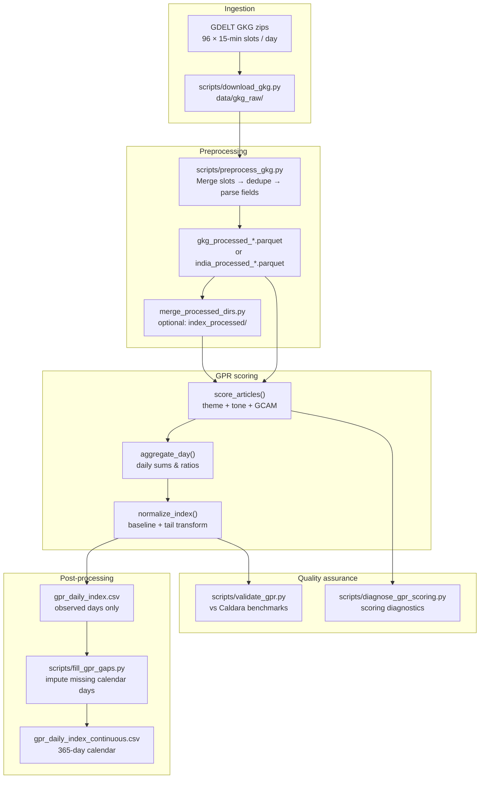
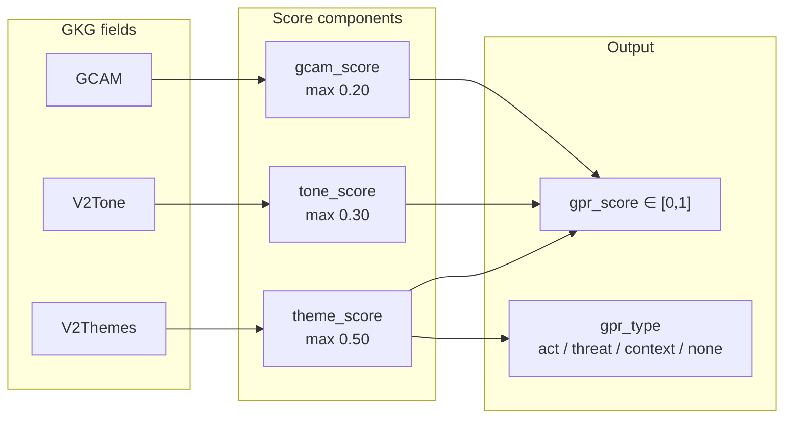
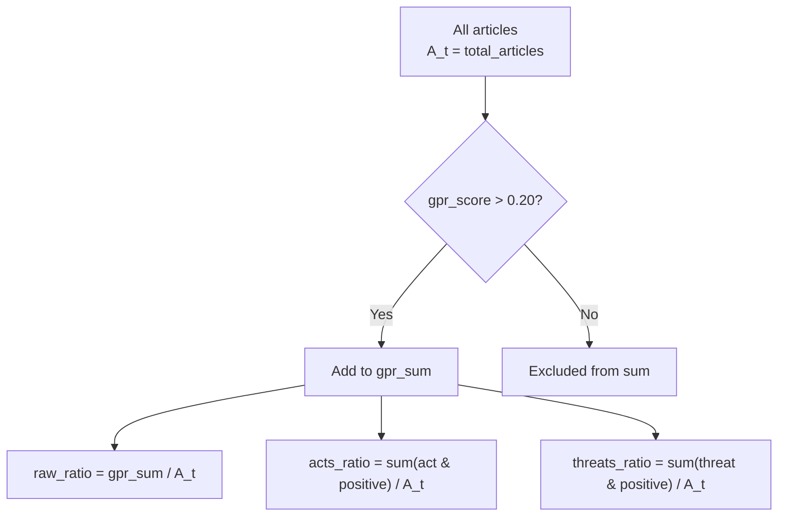
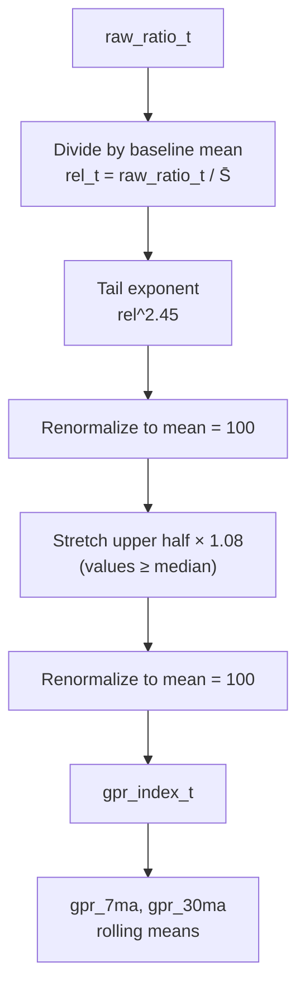
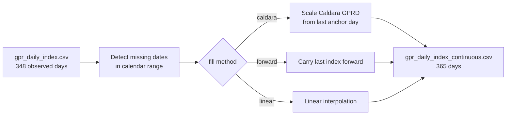

# Geopolitical Risk (GPR) — Theory & Calculations

This document explains how Forsyt builds the **Geopolitical Risk index** from GDELT Global Knowledge Graph (GKG) data. The implementation follows **Iacoviello & Tong (2026)**, which extends **Caldara & Iacoviello (2022)**.

**Primary source code:** `scripts/gkg_gpr_pipeline.py`, `scripts/split_era.py`, `scripts/paths.py`

**Input paths:** `data/gkg_processed/` (GDELT warmup) and `data/india_processed/` (India news product era). Merged symlink dir: `data/index_processed/` when running local warmup.

---

## Table of contents

1. [What GPR measures](#1-what-gpr-measures)
2. [Academic background](#2-academic-background)
3. [Pipeline overview](#3-pipeline-overview)
4. [Input data (GDELT GKG)](#4-input-data-gdelt-gkg)
5. [Article-level scoring](#5-article-level-scoring)
6. [Daily aggregation](#6-daily-aggregation)
7. [Index normalization](#7-index-normalization)
8. [Sub-indices and country level](#8-sub-indices-and-country-level)
9. [Split-era normalization (2026 product)](#9-split-era-normalization-2026-product)
10. [Incremental / dirty-day rescoring](#10-incremental--dirty-day-rescoring)
11. [Gap filling](#11-gap-filling)
12. [Output files](#12-output-files)
13. [Log interpretation](#13-log-interpretation)
14. [Back-calculations](#14-back-calculations)
15. [Validation benchmarks](#15-validation-benchmarks)
16. [Constants reference](#16-constants-reference)

---

## 1. What GPR measures

The GPR index is a **time series of geopolitical risk as reflected in global news coverage**.

| Property | Description |
|----------|-------------|
| **Unit** | Index level (100 = baseline average) |
| **Frequency** | Daily (monthly = mean of daily values) |
| **Direction** | Higher → more / more intense geopolitical risk in the news |
| **Scope** | Global (country-level variants also produced) |

GPR does **not** measure realized economic damage or market returns directly. It measures **news attention to adverse geopolitical events** — wars, terrorism, sanctions, nuclear threats, coups, diplomatic crises, etc.

---

## 2. Academic background

### 2.1 Caldara & Iacoviello (2022)

The original GPR index:

- Searched **10 major newspapers** with hand-curated keyword lists
- Split content into two sub-indices:
  - **GPA (Geopolitical Acts)** — events actually happening (invasion, attack, coup)
  - **GPT (Geopolitical Threats)** — risk building (sanctions, military buildup, crisis talk)
- Counted matching articles per day and normalized to an index averaging 100

### 2.2 Iacoviello & Tong (2026)

The modern replication uses **GDELT GKG**:

- Millions of articles from thousands of sources worldwide
- Structured metadata: theme codes, locations, tone, GCAM emotion dimensions
- **Article-level scores** \(S_{it} \in [0,1]\) instead of binary keyword hits
- Same conceptual aggregation as Caldara, scaled to GDELT volume

### 2.3 Core equation (Equation 1)

From Iacoviello & Tong (2026), implemented in `gkg_gpr_pipeline.py`:

```
GPR_t = (1 / S̄) × (1 / A_t) × Σ S_it
```

| Symbol | Name in code | Meaning |
|--------|--------------|---------|
| \(t\) | `date` | Calendar day |
| \(A_t\) | `total_articles` | All GKG articles published on day \(t\) |
| \(S_{it}\) | `gpr_score` | Score for article \(i\) on day \(t\) |
| Sum | over `gpr_score > 0.20` | Only **GPR-positive** articles count |
| \(\bar{S}\) | `_bar("raw_ratio")` | Baseline mean of the daily raw ratio |

**Intuition:** Take the weighted sum of risky articles, divide by total news volume (so more overall news doesn't automatically inflate the index), then rescale so the series averages 100 over the baseline window.

Forsyt adds a **tail calibration step** after baseline division so single-year samples match Caldara's right-skewed distribution (see [§7](#7-index-normalization)).

---

## 3. Pipeline overview



### Commands

```bash
cd gpr_index
python main.py download    --start-date 2025-01-01 --end-date 2025-12-31
python main.py preprocess  --start-date 2025-01-01 --end-date 2025-12-31
python main.py gpr         --start-date 2025-01-01 --end-date 2025-12-31
python main.py fill-gaps   --start-date 2025-01-01 --end-date 2025-12-31
python main.py validate    --start-date 2025-01-01 --end-date 2025-12-31
python main.py diagnose    --sample-days 5
```

---

## 4. Input data (GDELT GKG)

`scripts/preprocess_gkg.py` extracts seven GKG 2.0 columns per article:

| GKG column | Parsed field | Used for |
|------------|--------------|----------|
| DATE | `SQLDATE` | Timestamp |
| SourceCommonName | `SourceCommonName` | Source tracking |
| DocumentIdentifier | `DocumentIdentifier` | Dedup key |
| V2Themes | `V2Themes` | Theme taxonomy (TIER1/2/3) |
| V2Locations | `V2Locations` | Country-level index |
| V2Tone | `tone_neg`, `tone_polarity` | Tone score |
| GCAM | `GCAM` | Conflict emotion score |

Each calendar day merges **96 fifteen-minute slot files**, deduplicates by `DocumentIdentifier` (keeps latest slot), and writes one Snappy-compressed Parquet file.

---

## 5. Article-level scoring

Every article receives a score built from three capped components:

```
S_it = min(1.0, theme_score + tone_score + gcam_score)
```

If `theme_score == 0`, the entire article score is **0** (no geopolitical theme → excluded).



### 5.1 Theme score (max 0.50)

GDELT theme codes map to a three-tier taxonomy aligned with Caldara's Acts / Threats / Context:

| Tier | Weight | `gpr_type` | Role | Example codes |
|------|--------|------------|------|---------------|
| **TIER1** | 1.0 | `act` | Unambiguous geopolitical **acts** | `ARMEDCONFLICT`, `INVASION`, `TERROR_ATTACK`, `COUP`, `GENOCIDE`, `NUCLEAR_WEAPONS` |
| **TIER2** | 0.6 | `threat` | Geopolitical **threats** | `TERROR`, `SANCTION`, `NUCLEAR`, `DIPLOMATIC_CRISIS`, `TAX_FNCACT_MILITARY`, `PROXY_WAR` |
| **TIER3** | 0.3 | `context` | Minimal **context** | `ESPIONAGE`, `CYBERATTACK`, `WAR_CRIME` |

**Formula:**

```
raw_theme   = Σ(tier1 hits × 1.0) + Σ(tier2 hits × 0.6) + Σ(tier3 hits × 0.3)
theme_score = min(0.50, raw_theme / 3.0)
```

**Type priority:** If multiple tiers hit, `gpr_type` resolves as **act > threat > context**.

Full code lists live in `scripts/gkg_gpr_pipeline.py` (`TIER1`, `TIER2`, `TIER3`).

### 5.2 Tone score (max 0.30)

Parsed from GDELT V2Tone (negative tone and polarity):

```
neg_component = 0                                    if |tone_neg| ≤ 5
              = min(0.20, (|tone_neg| - 5) / 25 × 0.20)   otherwise

pol_component = min(0.10, |tone_polarity| / 20 × 0.10)

tone_score = neg_component + pol_component
```

Negative tone must exceed a floor (`TONE_NEG_MIN = 5.0`) before it contributes — this filters neutral or mildly negative articles.

### 5.3 GCAM score (max 0.20)

GCAM (Global Content Analysis Measures) provides emotion/conflict dimensions. Forsyt uses four conflict-related keys:

| Dimension | Weight | Role |
|-----------|--------|------|
| `c18.3` | 0.40 | Primary conflict signal |
| `c18.2` | 0.30 | Secondary conflict |
| `c18.1` | 0.20 | Tertiary conflict |
| `c9.1`  | 0.10 | Supporting dimension |

Each dimension must exceed **0.15** (`GCAM_DIM_MIN`) to count.

```
gcam_raw   = 0.40×c18.3 + 0.30×c18.2 + 0.20×c18.1 + 0.10×c9.1
gcam_score = min(0.20, gcam_raw)    ONLY if article has a TIER1 (act) theme
           = 0                       otherwise
```

GCAM boosts articles about **actual conflict events**, not generic threat coverage.

### 5.4 GPR-positive threshold

An article enters the daily sum only if:

```
gpr_score > 0.20    (GPR_POSITIVE_THRESHOLD)
```

This filters weak or ambiguous matches. The paper targets **10–25%** of articles as GPR-positive; Forsyt's 2025 full-year run averaged **12.5%**.

### 5.5 Worked example — threat article

Article themes: `SANCTION;TAX_FNCACT_MILITARY` (both TIER2)

```
raw_theme   = 0.6 + 0.6 = 1.2
theme_score = min(0.50, 1.2 / 3.0) = 0.40
gpr_type    = "threat"
```

With `tone_neg = 12`, `tone_polarity = 8`, no GCAM (no TIER1):

```
neg_component = min(0.20, (12 - 5) / 25 × 0.20) = 0.056
pol_component = min(0.10, 8 / 20 × 0.10)        = 0.040
tone_score    = 0.096
gcam_score    = 0.0

gpr_score = min(1.0, 0.40 + 0.096 + 0.0) = 0.496  → GPR-positive ✓
```

### 5.6 Worked example — act with GCAM

Article themes: `ARMEDCONFLICT` (TIER1), high conflict GCAM:

```
theme_score = min(0.50, 1.0 / 3.0) = 0.333
gpr_type    = "act"
gcam_score  = min(0.20, weighted GCAM)  → e.g. 0.15
tone_score  = e.g. 0.08

gpr_score = min(1.0, 0.333 + 0.08 + 0.15) = 0.563  → GPR-positive ✓
```

---

## 6. Daily aggregation

For each day's Parquet file, `aggregate_day()` computes:



### Column definitions

| Column | Formula | Role |
|--------|---------|------|
| `total_articles` | Count of all articles | \(A_t\) |
| `candidate_count` | Articles with any GPR theme (`gpr_type ≠ none`) | Pre-filter diagnostic |
| `gpr_positive_count` | Articles with `gpr_score > 0.20` | Numerator article count |
| `positive_share` | `gpr_positive_count / total_articles` | Daily hit rate |
| `gpr_sum` | Σ `gpr_score` over positive articles | Unscaled numerator |
| `mean_score` | `gpr_sum / gpr_positive_count` | Average severity of hits |
| **`raw_ratio`** | **`gpr_sum / total_articles`** | **Core input to index** |
| `acts_ratio` | Σ act-positive scores / `total_articles` | Acts sub-index input |
| `threats_ratio` | Σ threat-positive scores / `total_articles` | Threats sub-index input |
| `mean_theme_score` | Mean theme score of positives | Component diagnostic |
| `mean_tone_score` | Mean tone score of positives | Component diagnostic |
| `mean_gcam_score` | Mean GCAM score of positives | Component diagnostic |

### Worked example — 2025-01-01 (from pipeline log)

```
[20250101] scoring ... OK  (83,831 articles, 11,120 GPR+, sum=7044.4)
```

| Step | Calculation | Result |
|------|-------------|--------|
| Positive share | 11,120 ÷ 83,831 | 13.3% |
| Mean score | 7,044.4 ÷ 11,120 | 0.633 |
| **raw_ratio** | 7,044.4 ÷ 83,831 | **0.0840** |

The raw ratio (~8.4%) means that, on average, each article contributes 0.084 "risk units" when weighted by volume — before normalization.

---

## 7. Index normalization

Normalization converts `raw_ratio` into an interpretable index where **100 = baseline average**.



### Step 1 — Baseline division (\(\bar{S}\))

Over the baseline window (`--baseline-start` to `--baseline-end`, defaulting to the run date range):

```
S̄ = mean(raw_ratio) over baseline window

relative_t = raw_ratio_t / S̄
```

On an average day, `relative_t ≈ 1`.

### Step 2 — Tail calibration (Forsyt extension)

Single-year GDELT samples have lower variance than Caldara's multi-decade series. Forsyt applies:

```python
INDEX_TAIL_EXPONENT = 2.45
UPPER_TAIL_STRETCH  = 1.08
```

```
idx = (relative ^ 2.45)
idx = idx / mean(idx) × 100
idx = idx × 1.08   where idx ≥ median(idx)
gpr_index = idx / mean(idx) × 100
```

This restores **right skew** (occasional large spikes) matching published Caldara properties: skewness > 0.5, p99 in the 200–400 range.

The same transform applies independently to `acts_ratio` → `gpr_acts_index` and `threats_ratio` → `gpr_threats_index`.

### Step 3 — Moving averages

```
gpr_7ma  = 7-day rolling mean of gpr_index
gpr_30ma = 30-day rolling mean of gpr_index
```

**Important:** Daily raw GPR is very noisy. Validation against Caldara daily (`GPRD`) works best on **30-day moving averages** (target Pearson r > 0.50). Raw daily correlation is often near zero because both series are extremely volatile day-to-day.

### Monthly index

```
gpr_monthly = mean(gpr_index) over all days in the month
```

Monthly values also average ~100 over a full baseline year by construction.

---

## 8. Sub-indices and country level

### 8.1 Event-type sub-indices

Eight categories (`EVENT_CATEGORIES` in code) tag articles by primary theme:

| Category | Example themes |
|----------|----------------|
| `military_conflict` | `ARMEDCONFLICT`, `INVASION`, `GENOCIDE` |
| `terrorism` | `TERROR`, `TERROR_ATTACK` |
| `diplomatic_tension` | `DIPLOMATIC_CRISIS`, `BORDER_DISPUTE` |
| `nuclear_threat` | `NUCLEAR`, `NUCLEAR_WEAPONS`, `BALLISTIC_MISSILES` |
| `sanctions` | `SANCTION`, `BLOCKADE` |
| `coup_regime` | `COUP` |
| `civil_war` | `PROXY_WAR`, `TAX_FNCACT_REBEL` |
| `other` | GPR-positive but no category match |

Output: `gpr_event_type.csv` with daily `sum_{category}` columns.

### 8.2 Country-level index

For each country code extracted from `V2Locations`, positive article scores are summed and divided by total daily articles:

```
country_raw_ratio = Σ(positive gpr_score for articles mentioning country) / A_t
country_gpr_index = (country_raw_ratio / S̄_country) × 100
```

Country normalization uses **simple baseline scaling** (no tail exponent).

Output: `gpr_country_level.csv`

---

## 9. Split-era normalization (2026 product)

When GDELT GKG warmup (~15k–30k articles/day) and India news (~200–400 articles/day) share **one** baseline mean \(\bar{S}\), product-era scores collapse toward 1–2 instead of ~100. Forsyt fixes this with **split-era normalization** (`scripts/split_era.py`).

### Era boundaries

| Era | Dates (default) | Input parquets | Purpose |
|-----|-----------------|----------------|---------|
| **Warmup** | `GPR_WARMUP_START` → day before `INDIA_GPR_INDEX_START` | `gkg_processed_*.parquet` | Internal calibration; builds hit-days and GKG-scale baselines |
| **Product** | `>= INDIA_GPR_INDEX_START` (default **2026-08-09**) | `india_processed_*.parquet` | Scores shown in UI and synced to Postgres |

Env overrides: `GPR_WARMUP_START`, `INDIA_GPR_INDEX_START` (see `scripts/paths.py`).

### When split-era activates

`should_split_era(daily_df)` is true when the scoring batch contains dates **both before and on/after** `INDIA_GPR_INDEX_START`. Then:

1. **Separate baselines** — warmup rows normalize on GKG-era \(\bar{S}\); product rows on India-only \(\bar{S}\).
2. **Separate tail transforms** — same exponent (2.45) and stretch (1.08), applied per era.
3. **Product-only moving averages** — `gpr_7ma` and `gpr_30ma` roll only on rows `>= INDIA_GPR_INDEX_START` (avoids smearing the Aug 8→9 boundary).

If the batch is product-only (cloud hourly/daily jobs), a single India baseline applies — no split.

### Score semantics

| Layer | Warmup era | Product era |
|-------|------------|-------------|
| CSV outputs | Present (local rebuild) | Authoritative |
| Postgres / API | **Not synced** | Synced from Aug 9 |
| Interpretation | Calibration only | **100 = average India-news stress day** |

See also: [`docs/GDELT_WARMUP.md`](../../docs/GDELT_WARMUP.md) and `gpr_index/README.md`.

---

## 10. Incremental / dirty-day rescoring

Cloud jobs do not re-score the full history every hour. They pass **dirty days** (typically yesterday + today) to `--only-dirty-days`:

```bash
python main.py gpr --only-dirty-days 2026-08-20,2026-08-21
```

**Flow (`_run_incremental`):**

1. Load existing `gpr_daily_index.csv` (must include `raw_ratio`, `acts_ratio`, `threats_ratio`).
2. Re-score only dirty dates from `india_processed_*.parquet`.
3. Merge with preserved history → re-normalize the **full** series (split-era if applicable).
4. Re-run `fill_gpr_gaps` for continuous CSVs.

**Critical:** GPR normalization needs a **multi-day batch**. Single-day scoring forces index ≈ 100. Hourly/daily pipelines therefore always score from `INDIA_GPR_INDEX_START` through today while updating only dirty rows.

**Processed-dir rule:** Cloud CI uses `india_processed/` only (`GPR_INDEX_PROCESSED_DIR` unset). Local warmup sets `GPR_INDEX_PROCESSED_DIR` to merged `index_processed/`.

---

## 11. Gap filling

GDELT occasionally has missing days (e.g. **Jun 15 – Jul 1, 2025** → 17 missing days in a 365-day year). The GPR pipeline skips these; `fill_gpr_gaps.py` builds a calendar-complete series.



| Method | Behavior |
|--------|----------|
| **caldara** (default) | Anchor on last observed day; scale Caldara daily `GPRD` through the gap |
| **forward** | Repeat last observed index value |
| **linear** | Linear interpolation between boundary days |

Imputed rows are flagged:

- `is_imputed = True`
- `impute_method = caldara | forward | linear`
- Article counts set to 0

The original `gpr_daily_index.csv` is **never modified**.

---

## 12. Output files

| File | Rows | Contents |
|------|------|----------|
| `gpr_daily_index.csv` | Observed days only | Counts, sums, `gpr_index`, acts/threats indices, 7MA/30MA |
| `gpr_monthly_index.csv` | One per month | Monthly means of gpr / acts / threats |
| `gpr_event_type.csv` | Observed days | Eight event-category daily sums |
| `gpr_country_level.csv` | Country × day | Per-country GPR index |
| `gpr_article_scores.parquet` | All scored articles | Article-level debug: theme/tone/gcam/gpr_score |
| `gpr_daily_index_continuous.csv` | Full calendar | Observed + imputed days with flags |
| `gpr_monthly_index_continuous.csv` | Full calendar months | Includes imputed-day weighting |
| `outputs/validation/*.csv` | — | Benchmark comparison reports |

### Daily index columns (main file)

| Column | Description |
|--------|-------------|
| `date` | Calendar date |
| `total_articles` | \(A_t\) |
| `candidate_count` | Articles with any GPR theme |
| `gpr_positive_count` | Articles above threshold |
| `positive_share` | Hit rate |
| `mean_score` | Mean score of positives |
| `gpr_sum` | Sum of positive scores |
| `gpr_index` | Normalized global GPR (mean ≈ 100) |
| `gpr_acts_index` | Acts sub-index |
| `gpr_threats_index` | Threats sub-index |
| `gpr_7ma` | 7-day moving average |
| `gpr_30ma` | 30-day moving average |

---

## 13. Log interpretation

### GPR pipeline startup

```
[GPR] 348 daily files  2025-01-01 → 2025-12-31
[GPR] NOTE: 17 calendar day(s) missing GKG data in range (GDELT gap — skipped)
```

| Line | Meaning |
|------|---------|
| `348 daily files` | Parquet files found and scored |
| `17 missing` | Calendar days with no GKG data (skipped, not imputed yet) |

### Per-day scoring line

```
[20250101] scoring ... OK  (83,831 articles, 11,120 GPR+, sum=7044.4)
```

| Field | Maps to |
|-------|---------|
| `83,831 articles` | `total_articles` |
| `11,120 GPR+` | `gpr_positive_count` |
| `sum=7044.4` | `gpr_sum` |

### Checkpoint

```
  [PROGRESS] 30/348  (checkpoint saved)
```

Saves state to `outputs/_gpr_checkpoint/` every 30 days. Resume with:

```bash
python main.py gpr --resume ...
```

### Final summary

```
[GPR] Done.
  Days       : 348
  Mean GPR   : 100.0
  Max GPR    : 149.5  (2025-05-11)
  Pos. share : 12.5%
```

| Field | Expected |
|-------|----------|
| `Mean GPR` | ~100 (by normalization design) |
| `Max GPR` | Spike days; 2025 peak was 149.5 on May 11 |
| `Pos. share` | Target 10–25%; 12.5% is healthy |

### Gap-fill log

```
[GAPS] 17 missing calendar day(s):
  2025-06-15 ... 2025-07-01
[GAPS] Fill method: caldara
  Observed days  : 348
  Imputed days   : 17
  Total calendar : 365
```

### Diagnose output

`python main.py diagnose` prints:

- Score distribution buckets (0, 0.01–0.20, 0.21–0.40, …)
- Theme hit rates (tier1/2/3 %)
- Top theme codes by frequency
- Component means for GPR-positive articles
- Threshold sensitivity (how positive_share changes at 0.20, 0.25, 0.30, …)

Report saved to `outputs/validation/scoring_diagnosis.csv`.

---

## 14. Back-calculations

### From saved daily columns (exact)

If `gpr_daily_index.csv` still has count and sum columns:

```
raw_ratio      = gpr_sum / total_articles
positive_share = gpr_positive_count / total_articles
mean_score     = gpr_sum / gpr_positive_count
```

### Recovering acts/threats ratios (approximate)

`reprocess_index()` in `gkg_gpr_pipeline.py` uses the proportionality:

```
acts_ratio    ≈ raw_ratio × (gpr_acts_index / gpr_index)
threats_ratio ≈ raw_ratio × (gpr_threats_index / gpr_index)
```

This works because acts and total indices undergo the same transform.

### Inverting the tail transform (not exact)

The tail exponent (`^2.45`) and upper-half stretch are **nonlinear**. You cannot perfectly recover `raw_ratio` from `gpr_index` alone without:

1. All days' indices in the baseline window
2. The baseline mean `S̄`
3. Re-running `_apply_index_transform` logic in reverse (approximate at best)

**Always use `gpr_sum` and `total_articles` for the true pre-transform ratio.**

### Re-normalizing without re-scoring

```bash
python main.py reprocess --start-date 2025-01-01 --end-date 2025-12-31
```

Reads existing `gpr_daily_index.csv`, recomputes indices and gap-fill — useful after changing baseline dates or tail parameters.

---

## 15. Validation benchmarks

Run: `python main.py validate --start-date 2025-01-01 --end-date 2025-12-31`

### Statistical targets (Check 1)

| Metric | Target | Why |
|--------|--------|-----|
| Mean | 100 | By construction |
| Std | 35–70 | Match Caldara volatility |
| Skewness | > 0.5 | Risk spikes are rare but large |
| Median | 90–115 | Slightly below mean (right skew) |
| p99 | 200–400 | Tail events |
| Autocorr lag-90 | > 0.50 | Persistence (needs multi-year data; single-year uses lag-1) |
| Positive share | 10–25% | Article hit rate |

### Caldara correlation targets

| Comparison | Target r | Notes |
|------------|----------|-------|
| Monthly global GPR | > 0.50 | Primary benchmark |
| Monthly GPRC_IND (India) | > 0.45 | Country benchmark |
| Daily MA30 vs Caldara GPRD_MA30 | > 0.50 | **Best daily comparison** |
| Raw daily vs Caldara GPRD | — | Often ~0; too noisy to interpret |

### Known 2025 validation caveat

Seven of Caldara's top-10 spike days in 2025 fall inside the **Jun 15 – Jul 1 GKG gap**. Spike cross-checks for those dates rely on imputed values, not observed GDELT scoring.

---

## 16. Constants reference

All defined in `scripts/gkg_gpr_pipeline.py`:

| Constant | Value | Purpose |
|----------|-------|---------|
| `THEME_CAP` | 0.50 | Max theme component |
| `TONE_NEG_CAP` | 0.20 | Max negative-tone component |
| `TONE_POL_CAP` | 0.10 | Max polarity component |
| `TONE_NEG_MIN` | 5.0 | Tone floor before contributing |
| `GCAM_CAP` | 0.20 | Max GCAM component |
| `GCAM_DIM_MIN` | 0.15 | GCAM dimension activation threshold |
| `GPR_POSITIVE_THRESHOLD` | 0.20 | Minimum score to enter daily sum |
| `INDEX_TAIL_EXPONENT` | 2.45 | Tail amplification exponent |
| `UPPER_TAIL_STRETCH` | 1.08 | Upper-half stretch factor |

---

## Data flow summary

```
GDELT article
    │
    ├─ V2Themes  ──→ theme_score  (0 – 0.50)  ─┐
    ├─ V2Tone    ──→ tone_score   (0 – 0.30)  ─┼─→ gpr_score ∈ [0, 1]
    └─ GCAM      ──→ gcam_score   (0 – 0.20)  ─┘       │
                                                        │ if > 0.20
                                                        ▼
                                              gpr_sum = Σ gpr_score
                                                        │
                                                        ▼
                              raw_ratio = gpr_sum / total_articles
                                                        │
                                                        ▼
                              gpr_index = transform(raw_ratio / S̄) → mean 100
                                                        │
                                                        ▼
                              gpr_7ma, gpr_30ma, monthly means
```

---

## References

- Caldara, D., & Iacoviello, M. (2022). Measuring Geopolitical Risk. *American Economic Review*.
- Iacoviello, M., & Tong, M. (2026). Measuring Geopolitical Risk with AI. (GDELT GKG methodology.)
- GDELT Project: [https://www.gdeltproject.org/](https://www.gdeltproject.org/)
- Caldara GPR data: [https://www.matteoiacoviello.com/gpr.htm](https://www.matteoiacoviello.com/gpr.htm)
