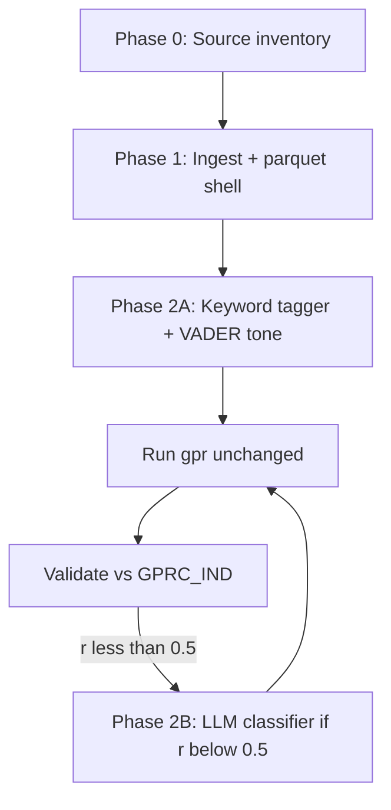

# Indian Newspaper Adapter Plan

Replace GDELT GKG with **direct Indian newspaper articles** while keeping `gkg_gpr_pipeline.py` (scoring + aggregation + validation) unchanged.

---

## Existing scraper: `origin/news_scraper` branch

**Branch:** `remotes/origin/news_scraper` (not on current `gpr_index` branch)

**Project:** Newsemble — real-time Indian news aggregator (English + Hindi)

| File | Role |
|------|------|
| `scraper.py` | 10 source classes (RSS + BeautifulSoup / LD+JSON) |
| `scheduler.py` | Scrape every 15 min, 7-day DB cleanup |
| `db.py` | SQLite `news.db` — articles table |
| `app.py` | Flask REST API (`GET /news/`, `/news/th`, etc.) |

**Sources (10):**

| Code | Outlet | Lang |
|------|--------|------|
| TH | The Hindu | en |
| TOI | Times of India | en |
| TIE | Indian Express | en |
| IT | India Today | en |
| NDTV | NDTV | en |
| AU | Amar Ujala | hi |
| BBC | BBC Hindi | hi |
| OI | OneIndia Hindi | hi |
| LH | Live Hindustan | hi |
| N18 | News18 Hindi | hi |

**SQLite schema → maps to adapter input:**

```
articles: id, title, content, source, link (UNIQUE), time, language, scraped_at
```

**Volume:** ~50–100 new articles per 15-min cycle; ~50k–70k rows steady state (7-day retention).

This branch covers **Phase 0 + Phase 1 fetch** from the plan below. Still needed: **`preprocess_indian_news.py`** (SQLite/JSON → GKG-compatible parquet) + **theme/tone tagging**.

### Checkout & run scraper

```bash
git fetch origin
git checkout news_scraper   # or: git worktree add ../forsyt-scraper news_scraper
cd newsemble  # if separate folder layout on that branch
python scheduler.py --once    # one scrape cycle
python app.py                 # API at http://127.0.0.1:5000/news/
```

### Integration path into Forsyt GPR

```
origin/news_scraper          Forsyt gpr_index (current)
─────────────────           ─────────────────────────
news.db (SQLite)     →      scripts/export_news_db.py  (NEW)
                            scripts/preprocess_indian_news.py  (NEW)
                            data/india_processed/*.parquet
                     →      python main.py gpr --processed-dir data/india_processed
                     →      validate vs GPRC_IND
```

**Recommendation:** Merge scraper into `news_scraper/` subfolder on `gpr_index`, or use a git worktree — avoid replacing the whole repo (news_scraper branch is a standalone 9-file app).

---

## Goal

Build a parallel ingest path:

```
Indian newspaper sources (HTML/PDF/RSS/API)
        ↓
  preprocess_indian_news.py   ← NEW
        ↓
  data/india_processed/india_processed_YYYYMMDD.parquet
  (same schema as gkg_processed_*.parquet)
        ↓
  gkg_gpr_pipeline.py         ← UNCHANGED (point --processed-dir)
        ↓
  outputs/india/              ← India-only GPR index
        ↓
  validate vs Caldara GPRC_IND
```

**Primary benchmark:** `GPRC_IND` in `data/data_gpr_export (1).xls` (not global GPR).

---

## Target Parquet Schema (must match GKG processed)

Each daily file: `india_processed_YYYYMMDD.parquet`

| Column | Source for Indian news |
|--------|------------------------|
| `SQLDATE` | Article publish datetime |
| `SourceCommonName` | e.g. `The Hindu`, `Times of India`, `Indian Express` |
| `DocumentIdentifier` | Canonical URL or `source::id` dedup key |
| `V2Themes` | **Synthetic** — semicolon-separated GDELT-style codes (see below) |
| `V2Locations` | **Synthetic** — `1#India#IN#...` or state codes if parsed |
| `GCAM` | **Synthetic or empty** — see Phase 2 |
| `tone_overall` | From sentiment model or newspaper API metadata |
| `tone_neg` | Absolute negative tone (align with GKG: higher = more negative) |
| `tone_polarity` | Subjectivity / polarity if available, else 0 |

Minimum for `score_articles()` to run: **V2Themes, tone_neg, tone_polarity, GCAM** (GCAM can be empty string → 0 contribution).

---

## Phase 0 — Source inventory (1–2 days)

~~Document each newspaper source~~ **Done on `origin/news_scraper`** — 10 sources, RSS + full-text extraction documented in `PROJECT_SUMMARY.txt` on that branch.

Remaining decisions:

| Item | Decision |
|------|----------|
| Sources | **10 ready** (TH, TOI, TIE, IT, NDTV + 5 Hindi) on `news_scraper` |
| Access | **SQLite `news.db`** + Flask API (already built) |
| Fields available | title, body, date, url, section, tags |
| Language | **Both en + hi** in scraper — start GPR on **English only** (`language='en'`) |
| Date range | Match Caldara overlap (e.g. 2015–2025 for validation) |
| Volume | Estimate articles/day (Caldara N10D ~526 global; India subset will be smaller) |
| Legal | Terms of use, storage, redistribution |

**Output:** `data/sources.yaml` — one entry per outlet with fetch method and parser.

---

## Phase 1 — Ingest & normalize (medium, ~1 week)

### New files

| File | Role |
|------|------|
| `scripts/preprocess_indian_news.py` | Daily merge → parquet |
| `scripts/sources/` | Per-outlet parsers (RSS, HTML) |
| `data/india_raw/` | Raw JSONL or CSV per day |
| `data/india_processed/` | Daily parquets |

### Pipeline steps

1. **Fetch** — `download-india` command (RSS poll or batch import)
2. **Normalize** — one row per article: `{url, source, published_at, title, body, section}`
3. **Dedup** — by URL; optional title+date fuzzy dedup
4. **Day bucket** — assign to calendar date (India timezone `Asia/Kolkata`)
5. **Write parquet** — after Phase 2 tagging/scoring columns added

### `main.py` commands (planned)

```bash
python main.py download-india  --start-date 2025-01-01 --end-date 2025-12-31
python main.py preprocess-india --start-date 2025-01-01 --end-date 2025-12-31
python main.py gpr --processed-dir data/india_processed --output-dir outputs/india ...
```

---

## Phase 2A — Keyword / taxonomy adapter (medium, ~1–2 weeks)

**Use when:** you have title + body text, want Caldara-aligned methodology, medium effort.

### Theme assignment

Map article text → **existing TIER1/2/3 codes** in `gkg_gpr_pipeline.py` using keyword dictionaries derived from Caldara/Iacoviello search terms.

```
scripts/india_taxonomy/
  keywords_tier1.yaml   # war, invasion, terror attack, …
  keywords_tier2.yaml   # sanctions, military buildup, …
  keywords_tier3.yaml   # espionage, cyberattack, …
```

**Module:** `scripts/theme_tagger.py`

```python
def tag_themes(title: str, body: str) -> str:
    """Return V2Themes string e.g. 'ARMEDCONFLICT;SANCTION'"""
```

Rules:
- Case-insensitive word/phrase match on title (weight 2×) + body
- Max N codes per article (avoid theme inflation)
- Optional: map Indian-specific terms (`Line of Control`, `Pakistan`, `border skirmish`) → `BORDER_DISPUTE`, `ARMEDCONFLICT`

### Tone (without GKG V2Tone)

| Option | Effort | Notes |
|--------|--------|-------|
| **A. Lexicon** | Low | Loughran-McDonald or custom negative word list → synthetic `tone_neg` |
| **B. VADER / TextBlob** | Low | Map compound score to GKG-like scale (calibrate on sample) |
| **C. FinBERT** | Medium | `tone_neg` from negative prob × 30 (match GKG scale ~0–30) |

Recommendation: **B or C** for Phase 2A; calibrate so mean `tone_neg` ≈ 3–5 on non-crisis days (matches GKG baseline).

### GCAM substitute

GKG GCAM conflict dimensions won't exist. Options:

| Option | GPR impact |
|--------|------------|
| **Empty GCAM** | Theme + tone only; scores lower, still valid |
| **Proxy from FinBERT** | Map fear/anger probs → synthetic `c18.1:0.2,c18.3:0.15` |
| **Skip GCAM gate** | Future flag in pipeline (only if needed) |

Recommendation: start with **empty GCAM**; India papers may already score via themes. Add FinBERT proxy only if `positive_share` or GPRC_IND correlation is weak.

### Location field

For India-focused index, set every article:

```
V2Locations = "1#India#IN#..."
```

Optional: parse states (`1#Kashmir#IN#...`) for sub-national later.

---

## Phase 2B — Model-based scoring (large, ~3–6 weeks)

**Use when:** keyword coverage is poor, or you want semantic matching (closer to Iacoviello 2026 AI-GPR).

### Architecture

```
Article (title + body)
        ↓
┌───────────────────────────────────────┐
│  Classifier (choose one)              │
│  • GPT-4o-mini — acts/threats/intensity│
│  • Local: FinBERT / DeBERTa multi-label│
│  • Hybrid: keywords gate + LLM score  │
└───────────────────────────────────────┘
        ↓
  gpr_score, theme_score, tone_score, gcam_score
        ↓
  Either:
    (A) Write synthetic V2Themes + tone → existing score_articles()
    (B) Replace score_articles() — larger refactor
```

**Recommendation:** **Hybrid (A)** first — LLM outputs theme codes + intensity 0–1, map to synthetic fields, keep `gpr` unchanged.

### LLM prompt schema (per article)

```json
{
  "gpr_relevant": true,
  "gpr_type": "act|threat|context|none",
  "theme_codes": ["ARMEDCONFLICT", "BORDER_DISPUTE"],
  "intensity": 0.72,
  "tone_negative": 8.5
}
```

Map to parquet:
- `V2Themes` = `;`.join(theme_codes)
- `tone_neg` = tone_negative
- `GCAM` = derived from intensity if needed

### Cost & scale

| Volume | GPT-4o-mini (rough) |
|--------|---------------------|
| 500 articles/day | ~$0.50–2/day |
| 5,000 articles/day | ~$5–20/day |

Use **batch + cache** keyed by `DocumentIdentifier`; sample for development.

### Validation expectation

Model-based scores may **not** match Caldara GPRC_IND as well as keyword+GKG approach initially. Tune toward **GPRC_IND monthly r > 0.50**, not global GPR.

---

## Phase 3 — India GPR index construction

Two product options:

### Option A — India corpus, global methodology (recommended first)

- All articles from Indian newspapers
- `V2Locations` = India
- Main index = `outputs/india/gpr_daily_index.csv`
- Compare to **GPRC_IND** (Caldara India country index)

### Option B — Filter global GKG to India mentions only

- Keep GKG pipeline; filter `gpr_country_level.csv` where `country_code == IN`
- Compare with Option A for consistency

---

## Phase 4 — Validation changes

Update `validate_gpr.py` for India runs:

| Check | Change |
|-------|--------|
| Caldara benchmark | **Primary: GPRC_IND**; secondary: global GPR |
| Daily correlation | Caldara has no India daily — use global GPRD_MA30 or skip |
| positive_share | Same 10–25% target |
| Coverage report | Articles/day vs Caldara N10 (global context only) |

Add `outputs/india/validation/source_coverage.csv`:
- articles per outlet per day
- keyword hit rate / model positive rate

---

## Phase 5 — Recommended rollout



| Milestone | Success criteria |
|-----------|------------------|
| M1 | 1 outlet, 30 days parquet, gpr runs without error |
| M2 | Full year, GPRC_IND monthly r > 0.45 |
| M3 | 10/10 statistical checks (or documented India-only targets) |
| M4 | Optional LLM upgrade if M2 fails |

---

## Effort summary

| Track | Effort | Caldara alignment | Keeps gpr unchanged |
|-------|--------|-------------------|---------------------|
| **2A Keyword adapter** | Medium (2–3 weeks) | Good if keywords mirror Caldara lexicon | Yes |
| **2B Model scoring** | Large (1–2 months) | Better semantics, needs tuning | Yes (hybrid) |
| **2B Replace score_articles** | Largest | Full AI-GPR path | No |

---

## What NOT to reuse from GKG path

| Component | India path |
|-----------|------------|
| `download_gkg.py` | Replace with `download_india.py` |
| `preprocess_gkg.py` | Replace with `preprocess_indian_news.py` |
| `fill_gkg_bigquery.py` | Not applicable |
| GKG theme codes in raw data | Must be **assigned** by tagger/LLM |

---

## Open decisions (need your input)

1. **Which newspapers** and access method (RSS vs licensed archive)?
2. **English only** first, or Hindi/regional from day one?
3. **Phase 2A only** for MVP, or jump to LLM (2B)?
4. **Date range** — 2025 only or multi-year for proper S_bar / autocorr?
5. **Article volume target** — full firehose vs curated geopolitics sections?

---

## Next implementation task (when approved)

1. ~~Create `data/sources.yaml`~~ — use `news_scraper` source codes (TH, TOI, …)
2. **Merge or worktree** `origin/news_scraper` into repo (`news_scraper/` subfolder)
3. Implement `scripts/export_news_db.py` — read `news.db` → daily JSONL/CSV
4. Implement `scripts/preprocess_indian_news.py` + `theme_tagger.py`
5. Wire `preprocess-india` in `main.py`
6. Smoke test: export 7 days → gpr → validate vs GPRC_IND
